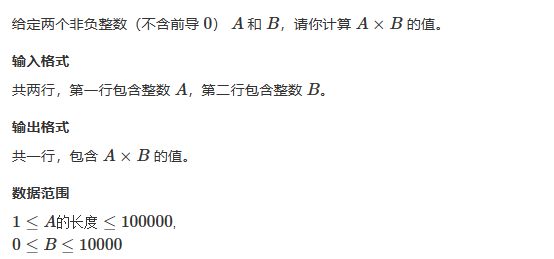
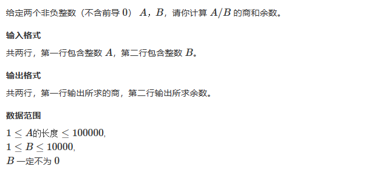

# 4 高精度

## 目录

- [4.1高精度加法](#41高精度加法)
  - [4.1.1模板](#411模板)
  - [4.1.2 例题](#412-例题)
- [4.2高精度减法](#42高精度减法)
- [4.3高精度乘法](#43高精度乘法)
- [4.4 两个高位数进行高精度乘法](#44-两个高位数进行高精度乘法)
- [4.5高精度除法](#45高精度除法)

# 4.1高精度加法

## 4.1.1模板

```c++
vector<int> high_accuracy_add(vector<int>& A, vector<int>& B)      
{
  vector<int> C;
  int t = 0;
  for (int i = 0; i < A.size() || i < B.size(); i++)
  {
    if (i < A.size())
      t += A[i];
    if (i < B.size())
      t += B[i];
    C.push_back(t % 10);
    t = t / 10;
  }
  if (t)
    C.push_back(1);
  return C;
}
```

## 4.1.2 例题

问题：

给定两个正整数（不含前导 0），计算它们的和。

解法：

我将长的字符串放入answer向量，短的放入input向量。

```c++
#include<bits/stdc++.h>
using namespace std;

vector<int> answer;
vector<int> input;
int cnt=0;
string a,b;

void init()
{
    if(a.size()>b.size())
    {
        for(int i=a.size()-1;i>=0;i--)
            answer.push_back(a[i]-'0');
        for(int i=b.size()-1;i>=0;i--)
            input.push_back(b[i]-'0');
    }
    else
    {
        for(int i=a.size()-1;i>=0;i--)
            input.push_back(a[i]-'0');
        for(int i=b.size()-1;i>=0;i--)
            answer.push_back(b[i]-'0');
    }
    
}

int main()
{
    cin>>a;
    cin>>b;
    init();
    int i=0;
    for(i=0;i<input.size();i++)
    {
        cnt=input[i]+answer[i]+cnt;
        answer[i]=cnt%10;
        cnt/=10;
    }
    while(cnt!=0)
    {
        
        if(i<answer.size())
        {
            cnt=answer[i]+cnt;
            answer[i]=cnt%10;
            cnt/=10;
        }
        else
        {
            answer.push_back(cnt);
            break;
        }
        i++;
    }
    for(int i=answer.size()-1;i>=0;i--)
        cout<<answer[i];
}


```

# 4.2高精度减法

```c++
vector<int> high_accuracy_sub(vector<int>& A, vector<int>& B)
{
  vector<int> C;
  int t = 0;
  for (int i = 0; i < A.size() || i < B.size(); i++)
  {
    t = A[i] - t;
    if (i < B.size())
      t = t - B[i];
    C.push_back((t + 10) % 10);
    if (t < 0)
      t = 1;
    else
      t = 0;
  }

  while (C.size() > 1 && C.back() == 0)        //如003，要去掉前面的0
    C.pop_back();
  return C;
}
```

# 4.3高精度乘法



```c++
#include<iostream>
#include<vector>
using namespace std;


string a;
int b;
vector<int> input;
vector<int> answer;


void init()
{
    for(int i=a.size()-1;i>=0;i--)
        input.push_back(a[i]-'0');
}


int main()
{
    cin>>a;
    cin>>b;
    init();
    int i=0;
    int cnt=0;
    for(i=0;i<input.size();i++)
    {
        cnt=input[i]*b+cnt;
        answer.push_back(cnt%10);
        cnt/=10;
    }
    while(cnt)
    {
        answer.push_back(cnt%10);
        cnt/=10;
    }
    
    for(int i=answer.size()-1;i>=0;i--)
    {
        if(answer[i]==0&&i!=0)
            answer.pop_back();
        else
            break;
    }
        
    
    for(int i=answer.size()-1;i>=0;i--)
        cout<<answer[i];
}


```

# 4.4 两个高位数进行高精度乘法

```c++
void two_high_accuracy_mul()
{
  int answer[MAX_NUM];
  int a[MAX_NUM], b[MAX_NUM];
  int length = 0;
  string str1, str2;
  cin >> str1 >> str2;
  for (int i = 0; i < str1.size(); i++)
  {
    a[i] = str1[str1.size() - i - 1] - '0';
  }
  for (int i = 0; i < str2.size(); i++)
  {
    b[i] = str2[str2.size() - i - 1] - '0';
  }

  int pos;
  for (int i = 0; i < str2.size(); i++)
  {
    pos = i;
    int cnt = 0;
    for (int j = 0; j < str1.size(); j++)
    {
      cnt = a[j] * b[i] + cnt + answer[pos];
      answer[pos] = cnt % 10;
      cnt = cnt / 10;
      pos++;
    }
    if (cnt != 0)
    {
      answer[pos] = cnt;
      pos++;
    }
  }

  //0*10会有00
  for (int i = pos - 1; i > 0; i--)
  {
    if (answer[i] == 0)
      pos--;
    else
      break;
  }

  for (int i = pos - 1; i >= 0; i--)
  {
    cout << answer[i];
  }
}
```

# 4.5高精度除法



```c++
#include<iostream>
#include<vector>
#include<algorithm>
using namespace std;

string a;
int b;
vector<int> input;
vector<int> answer;
int n;
int cnt = 0;

void init()
{
    for (int i = a.size() - 1; i >= 0; i--)
        input.push_back(a[i] - '0');
}


void div()
{
    for (int i = input.size() - 1; i >= 0; i--)
    {
        cnt = cnt * 10 + input[i];
        answer.push_back(cnt / b);
        cnt = cnt % b;
    }
    //翻转的目的是将高位放在后面，这样就可以用pop_back去前导0
    reverse(answer.begin(), answer.end());
    //去0
    for (int i = answer.size() - 1; i >= 0; i--)
    {
        if (answer[i] == 0 && i != 0)
            answer.pop_back();
        else
            break;
    }
}


int main()
{
    cin >> a;
    cin >> b;
    init();
    div();

    for (int i = answer.size() - 1; i >= 0; i--)
        cout << answer[i];
    cout << endl;
    cout << cnt << endl;
}


```
