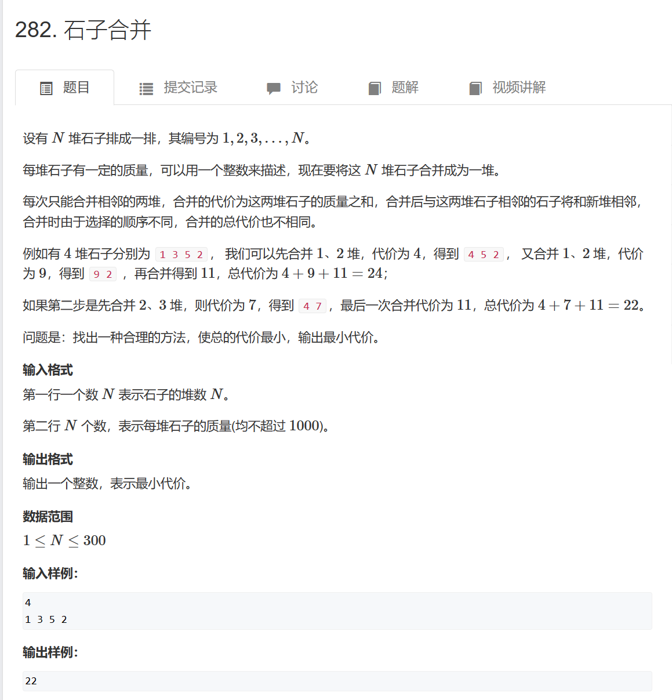

# 区间DP

# 1. 题目



# 2. 思路

f\[L]\[R]表示从L到R的石子合并的最小值。等于f\[L]\[K]石子堆与f\[K+1]\[R]石子堆合并的最小值。

即：f\[L]\[R] = f\[L]\[K] + f\[K+1]\[R] + cnt\[R] - cnt\[L - 1]

本题遍历时，需按照长度遍历。因为在计算f\[L]\[R]时，需要用到f\[K+1]\[R]，如果按照L遍历，则f\[K+1]\[R]不会在使用前被计算完成。例如，现在要计算f\[1]\[5]，需要用到f\[3]\[5]，如果按照L遍历，此时在遍历L=1，则f\[3]\[5]不会被计算。

# 3. 代码

```python
#include <iostream>
using namespace std;

int n;
int cnt[100010];
int f[1010][1010];

int main()
{
    cin >> n;
    for (int i = 1; i <= n; i++)
    {
        cin >> cnt[i];
        cnt[i] += cnt[i - 1];
    }
       

    for (int len = 2; len <= n; len++)
    {
        for (int l = 1; l + len - 1 <= n; l++)
        {
            int r = l + len - 1;
            f[l][r] = 1e9;
            for (int k = l; k < r; k++)
                f[l][r] = min(f[l][r], f[l][k] + f[k + 1][r] + cnt[r] - cnt[l - 1]);
        }
    }

    cout << f[1][n] << endl;
    return 0;
}
```
