# 打印

# 1.0/1背包问题

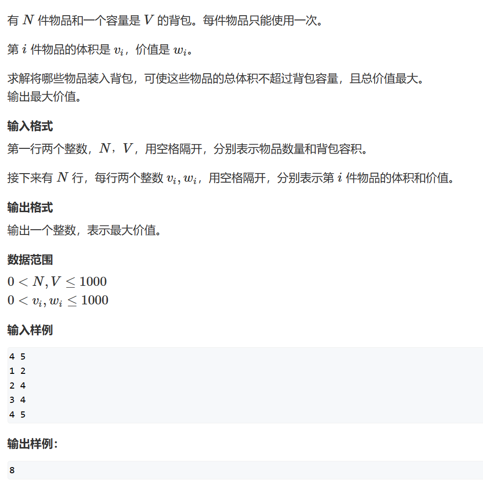

```c++
#include<iostream>
#include<cstring>
#include<algorithm>
using namespace std;

int N, V;
int v[1010];
int w[1010];
int f[1010];

int main()
{
    cin >> N >> V;
    for(int i = 1; i <= N; i++)
        cin >> v[i] >> w[i];
        
    for(int i = 1; i <= N; i++)
        for(int j = V; j >= v[i]; j--)
            f[j] = max(f[j], f[j - v[i]] + w[i]);
            
    cout << f[V] << endl;
}
```

# 2. 完全背包问题

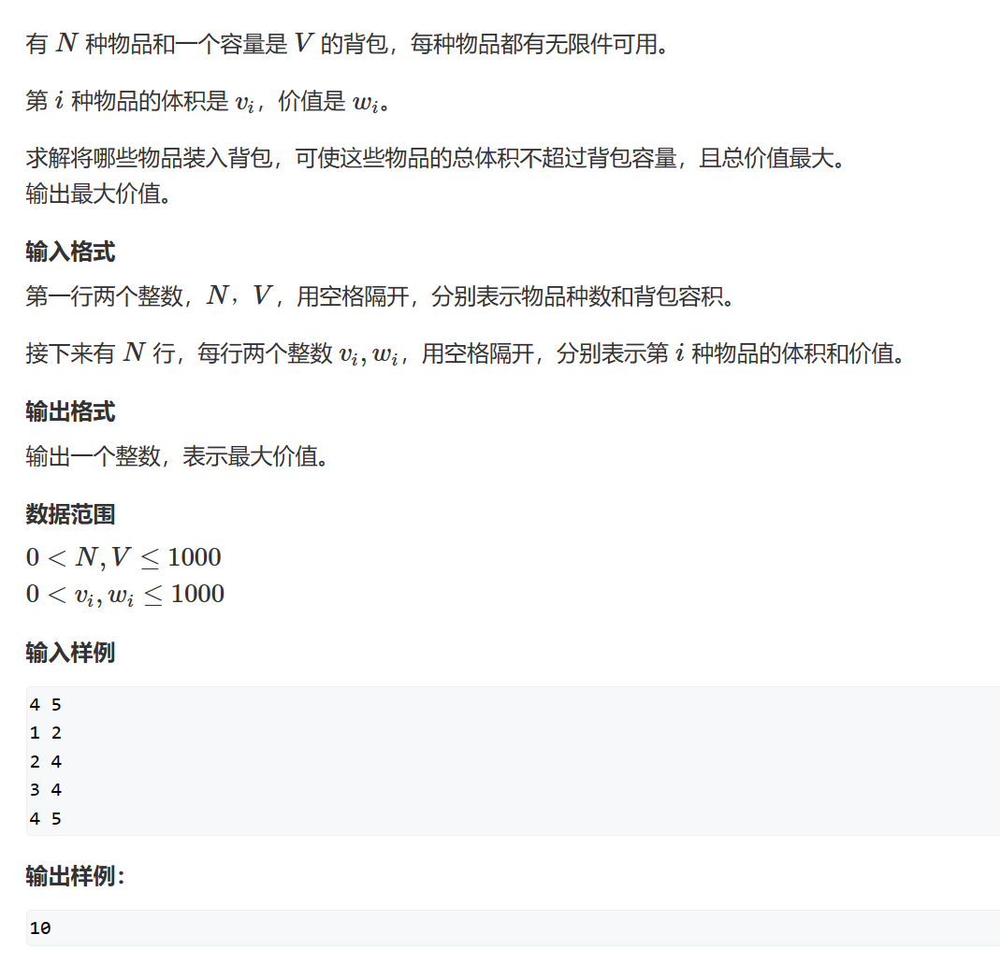

```c++
#include<iostream>
using namespace std;

int N, V;
int v[100010];
int w[100010];
int f[100010];

int main()
{
    cin >> N >> V;
    for(int i = 1; i <= N; i++)
        cin >> v[i] >> w[i];
        
    for(int i = 1; i <= N; i++)
        for(int j = v[i]; j <= V; j++)
            f[j] = max(f[j], f[j - v[i]] + w[i]);
            
    cout << f[V] << endl;
}
```

# 3. 多重背包问题

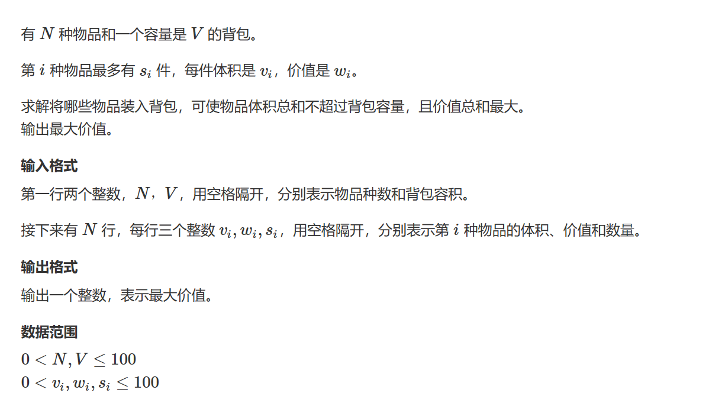

```c++
#include<iostream>
#include<cstring>
#include<algorithm>
#include<cmath>
using namespace std;

int N, V;
int v[20010];
int w[20010];
int s[20100];
int f[20010];

int main()
{
    cin >> N >> V;
    int cnt = 0;
    for (int k = 1; k <= N; k++)
    {
        int num, cost, worth;
        cin >> cost >> worth >> num;

        int i = 0;
        int last = num;
        while (last >= pow(2, i))
        {
            cnt++;
            w[cnt] = pow(2, i) * worth;
            v[cnt] = pow(2, i) * cost;
            last -= pow(2, i);
            i++;
        }
        if (last)
        {
            cnt++;
            w[cnt] = last * worth;
            v[cnt] = last * cost;
        }
    }

    for (int i = 1; i <= cnt; i++)
        for (int j = V; j >= v[i]; j--)
            f[j] = max(f[j], f[j - v[i]] + w[i]);

    cout << f[V] << endl;
}


```

# 4. 分组背包问题

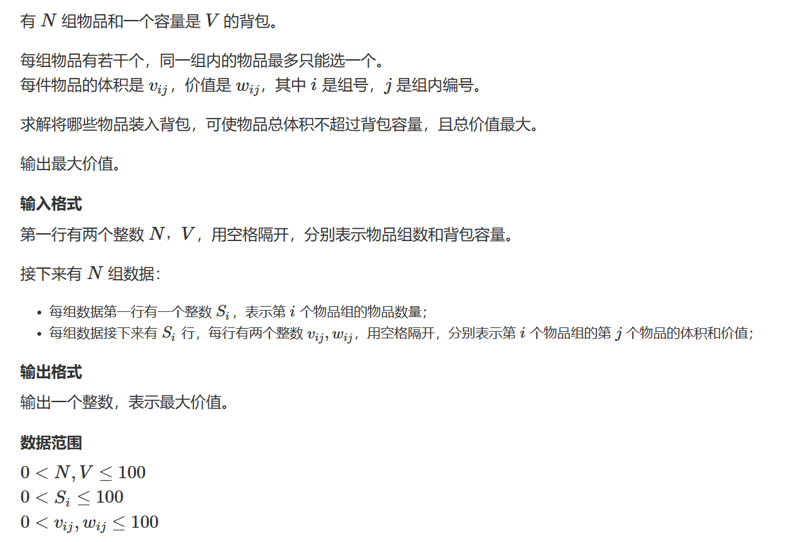

```c++
#include<iostream>
#include<cstring>
#include<algorithm>
using namespace std;

int N, V;
int s[110];
int v[110][110];
int w[110][110];
int f[110];

int main()
{
    cin >> N >> V;
    for(int i = 1; i <= N; i++)
    {
        cin >> s[i];
        for(int j = 1; j <= s[i]; j++)
            cin >> v[i][j] >> w[i][j];
    }
    
    for(int i = 1; i <= N; i++)
        for(int j = V; j >= 0; j--)
            for(int k = 1; k <= s[i]; k++)
                if(j >= v[i][k])
                    f[j] = max(f[j], f[j - v[i][k]] + w[i][k]);
                    
    cout << f[V] << endl;
}
```

# 5. 线性DP-数字三角形

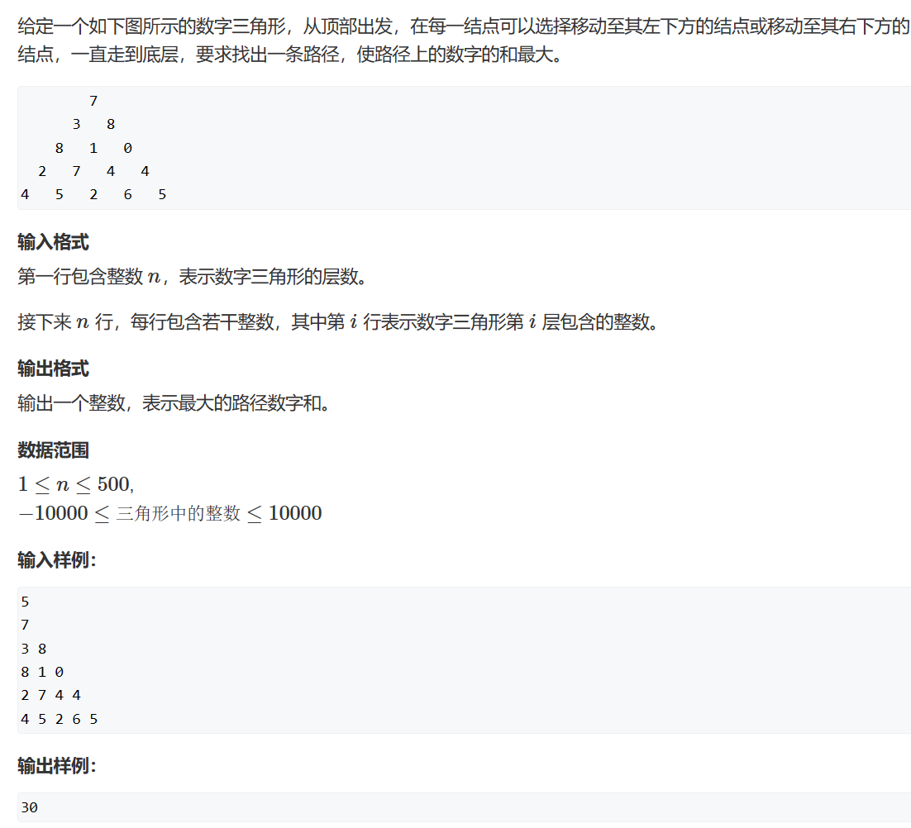

```c++
#include<iostream>
#include<cstring>
#include<algorithm>
#define MIN_NUM -0x3f3f3f3f
using namespace std;


int a[510][510];
int f[510][510];
int n;


int main()
{
  cin >> n;
  memset(f, -0x3f, sizeof f);
  for (int i = 1; i <= n; i++)
    for (int j = 1; j <= i; j++)
      cin >> a[i][j];
  f[1][1] = a[1][1];

  for (int i = 2; i <= n; i++)
    for (int j = 1; j <= i; j++)
    {
      f[i][j] = max(f[i - 1][j - 1], f[i - 1][j]) + a[i][j];
    }

  int res = MIN_NUM;
  for (int i = 1; i <= n; i++)
    res = max(res, f[n][i]);

  cout << res << endl;
}
```

# 6. 线性DP-最长上升子序列

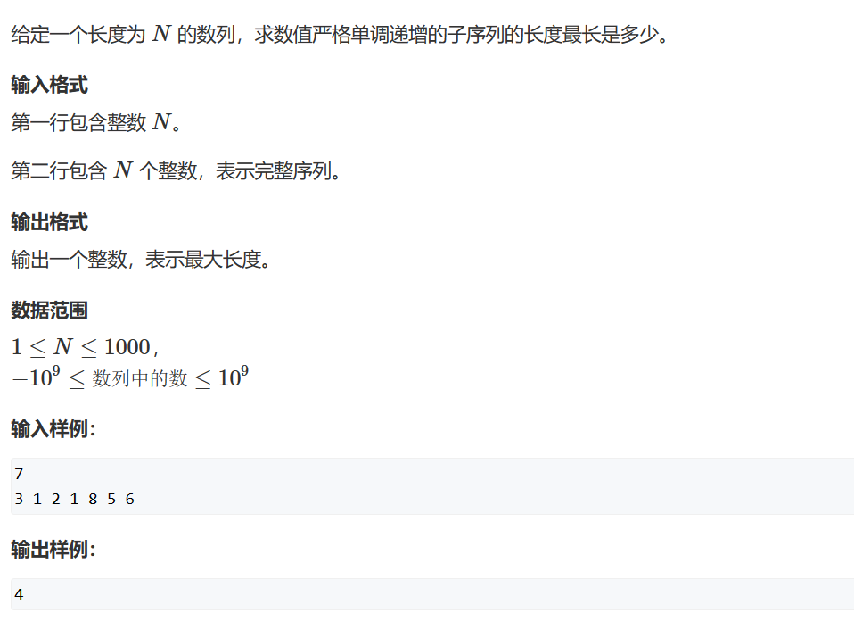

```c++
#include<iostream>
using namespace std;


int n;
int a[100010];
int p[100010];
int len = 0;


int find(int x)
{
  int l = 0;
  int r = len;
  while (l < r)
  {
    int mid = l + r + 1 >> 1;
    if (p[mid] < x)
      l = mid;
    else
      r = mid - 1;
  }
  return l;
}


int main()
{
  cin >> n;
  for (int i = 1; i <= n; i++)
    cin >> a[i];

  for (int i = 1; i <= n; i++)
  {
    int pos = find(a[i]);
    p[pos + 1] = a[i];
    len = max(len, pos + 1);
  }

  cout << len << endl;
}

```

# 7. 最长公共子序列

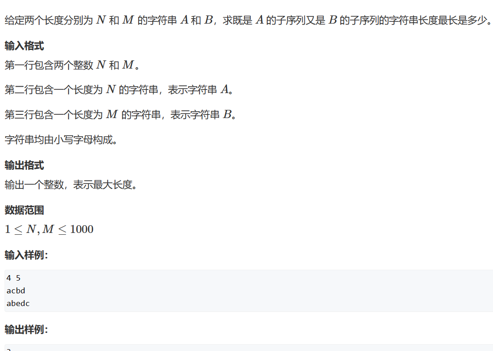

```c++
#include<iostream>
using namespace std;

int n, m;
char a[1010];
char b[1010];
int f[1010][1010];


int main()
{
  cin >> n >> m;
  for (int i = 1; i <= n; i++)
    cin >> a[i];
  for (int i = 1; i <= m; i++)
    cin >> b[i];

  for (int i = 1; i <= n; i++)
  {
    for (int j = 1; j <= m; j++)
    {
      f[i][j] = max(f[i - 1][j], f[i][j - 1]);
      if (a[i] == b[j])
        f[i][j] = max(f[i][j], f[i - 1][j - 1] + 1);
    }

  }

  cout << f[n][m] << endl;
}
```

# 8. 最短编辑距离

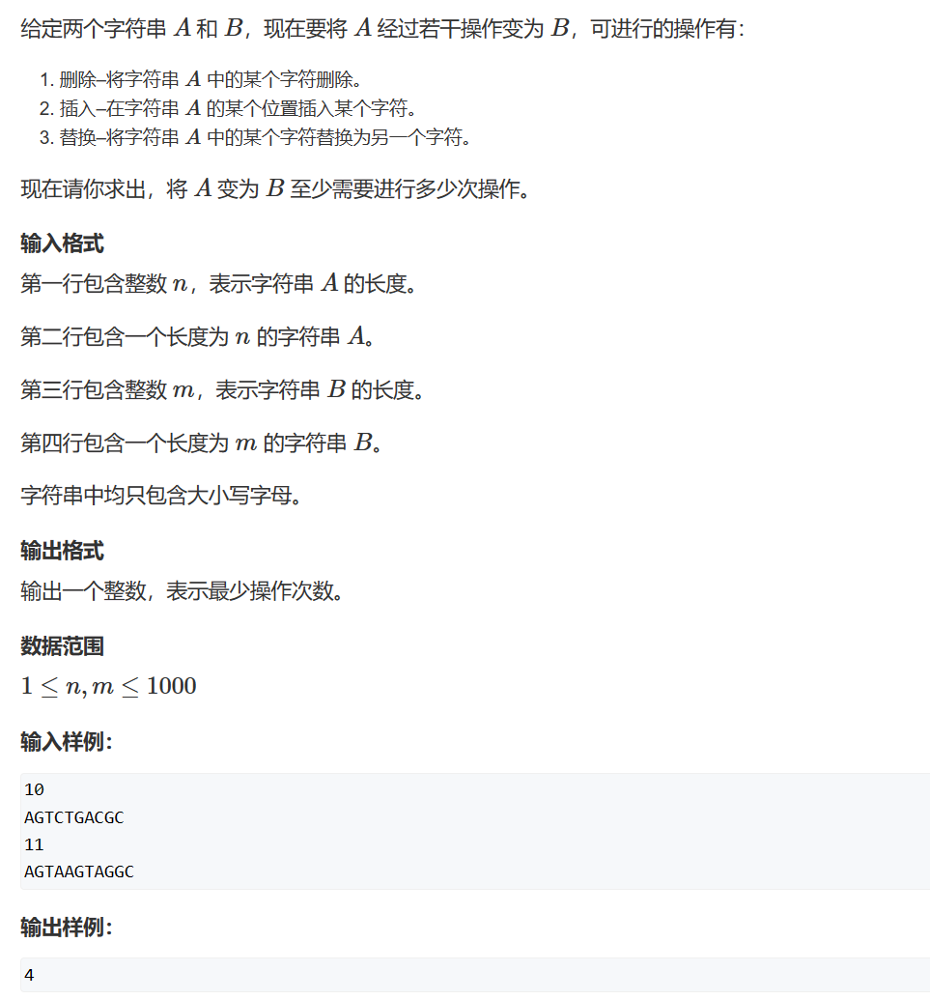

```c++
#include<iostream>
#include<algorithm>
using namespace std;

int n, m;
char a[1010];
char b[1010];
int f[1010][1010];


int main()
{
  cin >> n;
  for (int i = 1; i <= n; i++)
  {
    cin >> a[i];
    f[i][0] = i;
  }  
  cin >> m;
  for (int i = 1; i <= m; i++)
  {
    cin >> b[i];
    f[0][i] = i;
  }
    
  for (int i = 1; i <= n; i++)
  {
    for (int j = 1; j <= m; j++)
    {
      f[i][j] = min(f[i][j - 1] + 1, f[i - 1][j] + 1);
      if (a[i] == b[j])
        f[i][j] = min(f[i][j], f[i - 1][j - 1]);
      else
        f[i][j] = min(f[i][j], f[i - 1][j - 1] + 1);
    }
  }

  cout << f[n][m] << endl;
}
```

# 9. 编辑距离

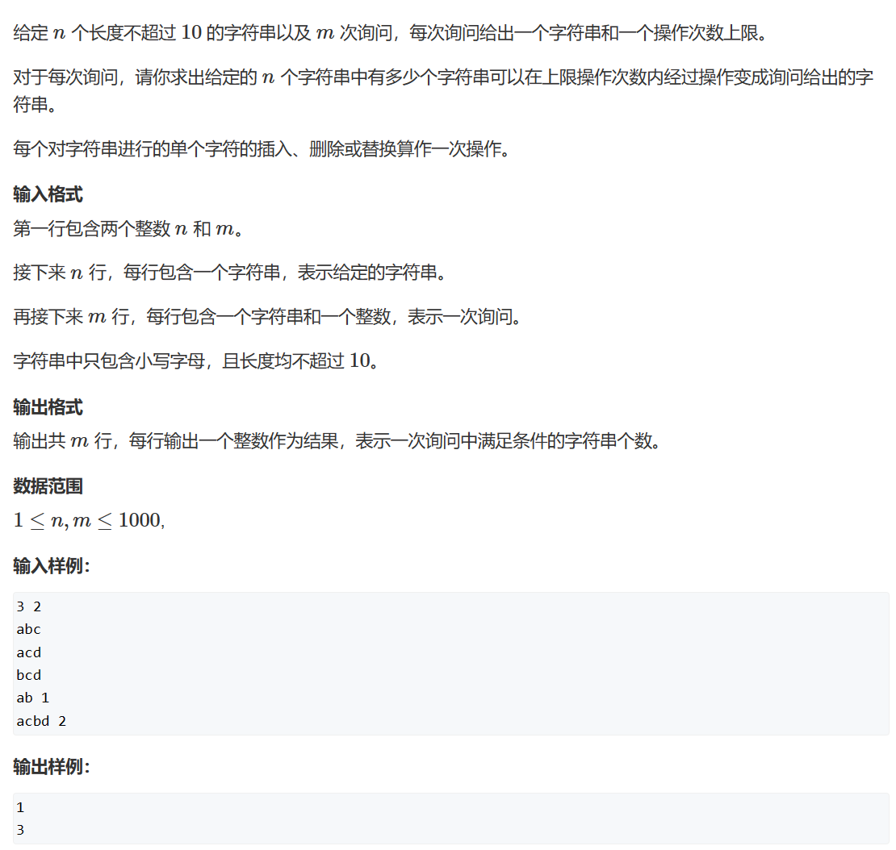

```c++
#define _CRT_SECURE_NO_WARNINGS
#include<iostream>
#include<algorithm>
#include<cstring>
using namespace std;

int n, m;
char a[1010][20];
char b[1010];
int f[1010][1010];


int judge(int x)
{
  int len_a = strlen(a[x] + 1);
  int len_b = strlen(b + 1);
  for (int i = 1; i <= len_a; i++)
    f[i][0] = i;
  for (int i = 1; i <= len_b; i++)
    f[0][i] = i;

  for (int i = 1; i <= len_a; i++)
    for (int j = 1; j <= len_b; j++)
    {
      f[i][j] = min(f[i - 1][j] + 1, f[i][j - 1] + 1);
      if (a[x][i] == b[j])
        f[i][j] = min(f[i][j], f[i - 1][j - 1]);
      else
        f[i][j] = min(f[i][j], f[i - 1][j - 1] + 1);
    }
  return f[len_a][len_b];
}


int main()
{
  cin >> n >> m;
  for (int i = 1; i <= n; i++)
  {
    scanf("%s", a[i] + 1);
  }

  while (m--)
  {
    int ans = 0;
    int limit;
    scanf("%s", b + 1);
    cin >> limit;
    for (int i = 1; i <= n; i++)
      if (judge(i) <= limit)
        ans++;
    cout << ans << endl;
  }
}
```

# 10. 区间DP

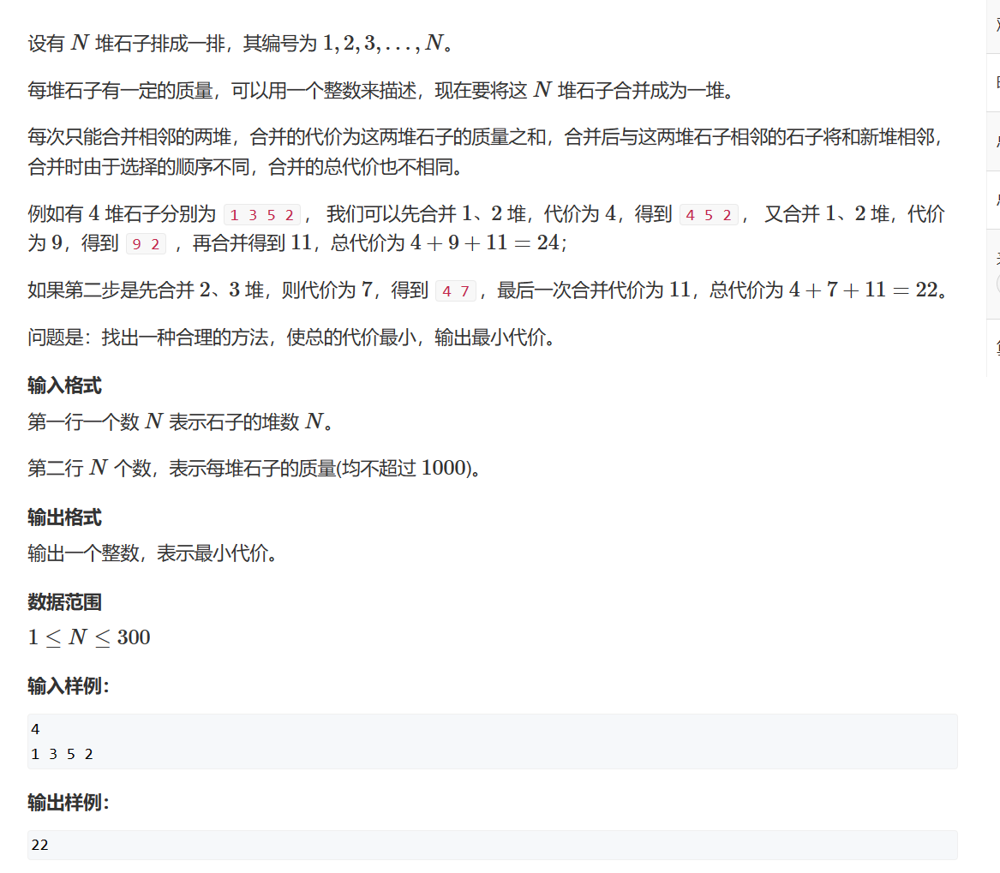

```c++
#include<iostream>
using namespace std;

int n;
int s[1010];
int f[1010][1010];


int main()
{
  cin >> n;
  for (int i = 1; i <= n; i++)
  {
    cin >> s[i];
    s[i] += s[i - 1];
  }

  for (int len = 2; len <= n; len++)
  {
    for (int i = 1; i + len - 1 <= n; i++)
    {
      int l = i;
      int r = i + len - 1;
      f[l][r] = 1e9;
      for (int k = l; k <= r; k++)
        f[l][r] = min(f[l][r], f[l][k] + f[k + 1][r] + s[r] - s[l - 1]);
    }
  }
  cout << f[1][n] << endl;
}
```

# 11. 计数DP

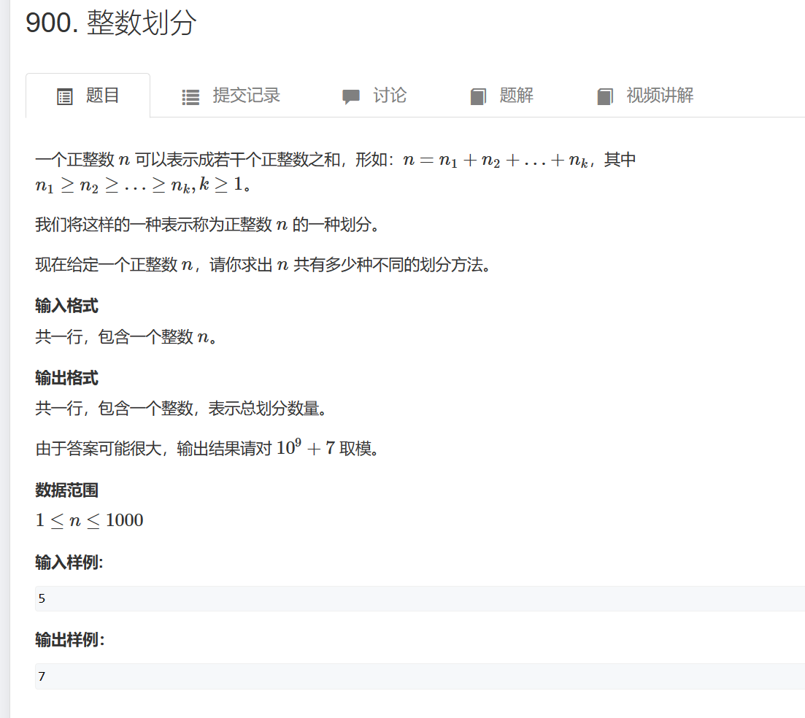

```c++
#include<iostream>
using namespace std;

int n;
int f[1010];
int MAX_NUM=1e9+7;

int main()
{
    cin>>n;
    f[0]=1;
    for(int i=1;i<=n;i++)
        for(int j=i;j<=n;j++)
            f[j]=(f[j]+f[j-i])%MAX_NUM;
            
    cout<<f[n]<<endl;
}
```
