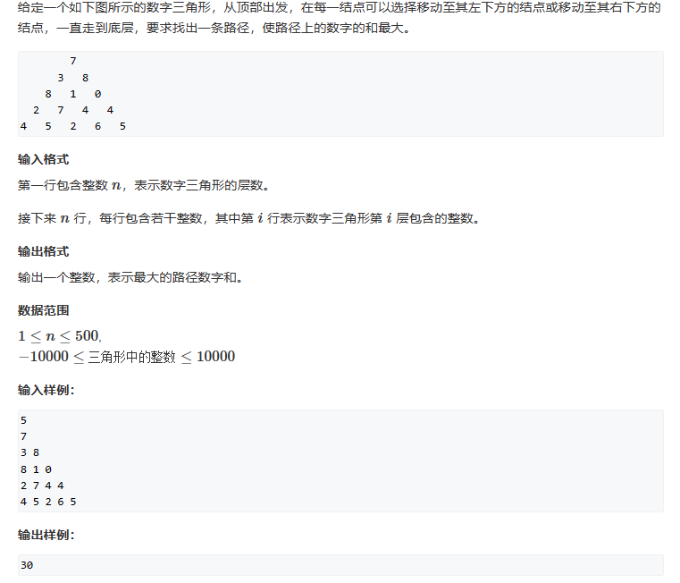
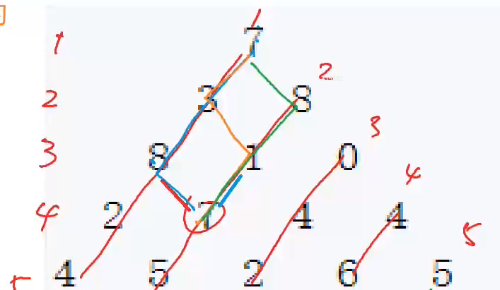
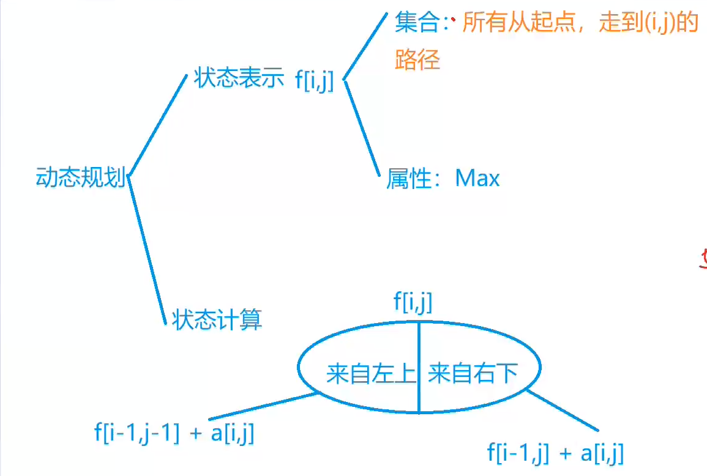
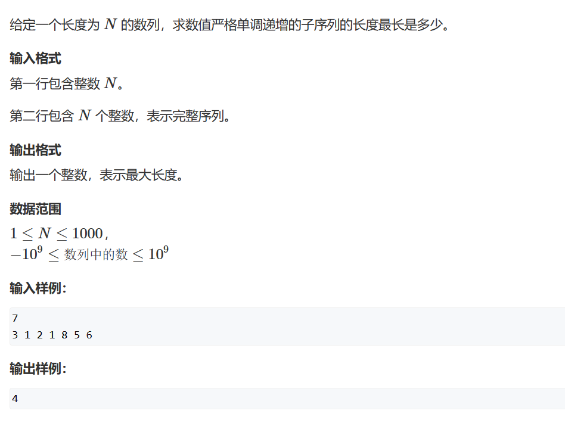
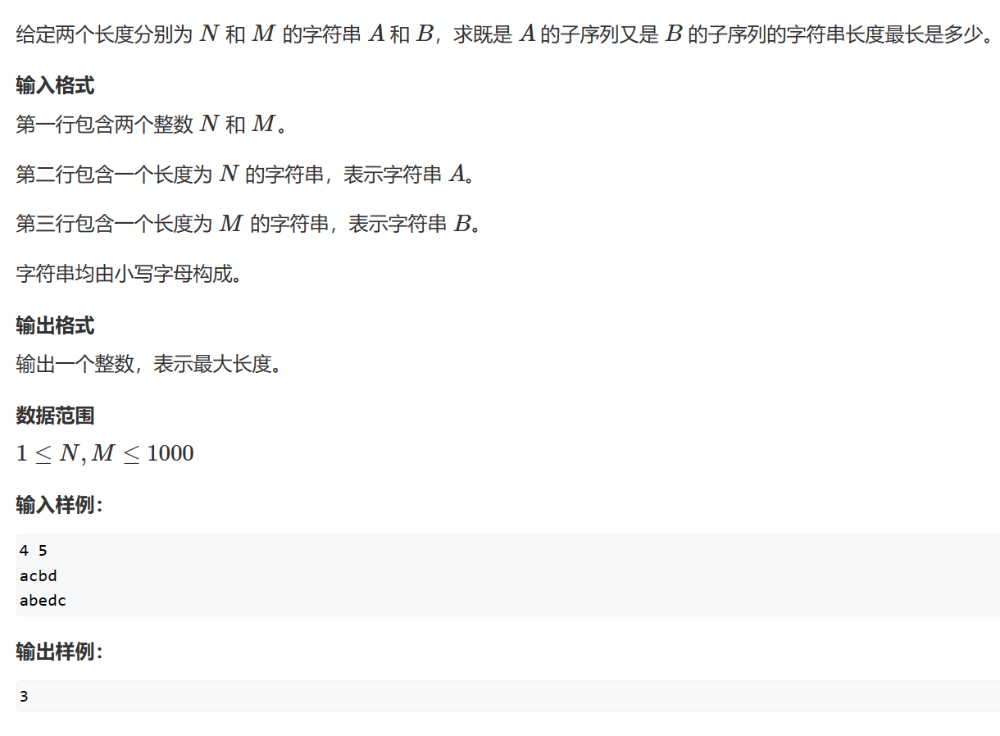
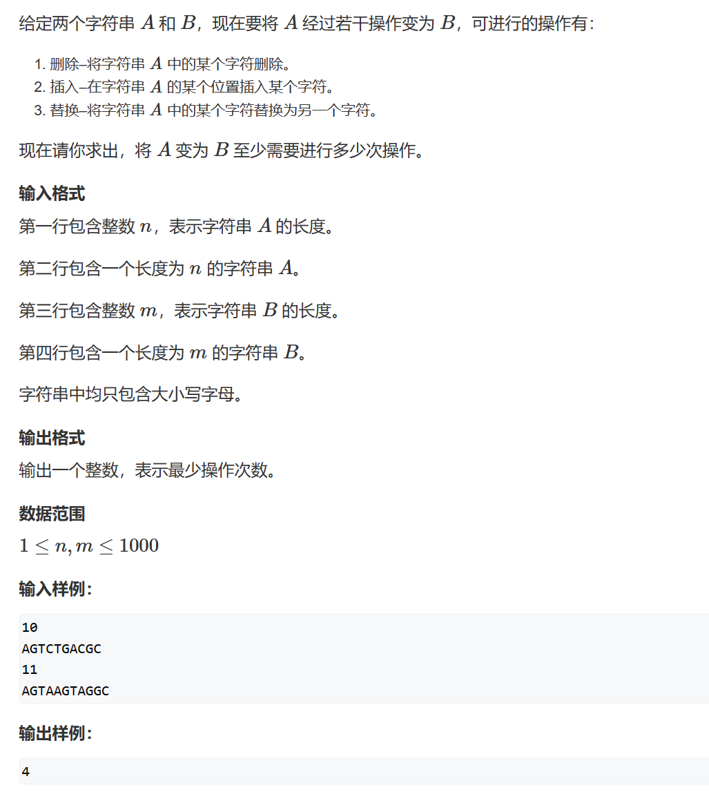
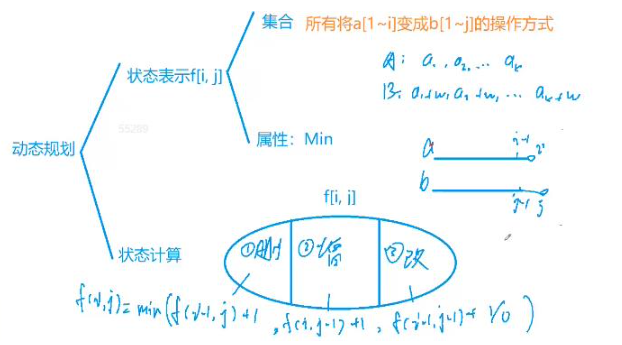

# 线性DP

# 1. 数字三角形

## 1.1 题目



## 1.2 题解





## 1.3 代码

```c++
#include<iostream>
#include<cstring>
#include<algorithm>
#define MIN_NUM -0x3f3f3f3f
using namespace std;


int a[510][510];
int f[510][510];
int n;


int main()
{
  cin >> n;
  memset(f, -0x3f, sizeof f);
  for (int i = 1; i <= n; i++)
    for (int j = 1; j <= i; j++)
      cin >> a[i][j];
  f[1][1] = a[1][1];

  for (int i = 2; i <= n; i++)
    for (int j = 1; j <= i; j++)
    {
      f[i][j] = max(f[i - 1][j - 1], f[i - 1][j]) + a[i][j];
    }

  int res = MIN_NUM;
  for (int i = 1; i <= n; i++)
    res = max(res, f[n][i]);

  cout << res << endl;
}
```

# 2. 最长上升子序列

## 2.1 题目



## 2.2 题解

设置f\[i]表示以第i个元素结尾的最长子序列长度。

```c++
#include<iostream>
#include<cstring>
using namespace std;


int n;
int a[1010];
int f[1010];


int main()
{
  cin >> n;
  for (int i = 1; i <= n; i++)
  {
    cin >> a[i];
    f[i] = 1;
  }

  for (int i = 1; i <= n; i++)
  {
    for (int j = 1; j < i; j++)
    {
      if (a[j] < a[i])
        f[i] = max(f[i], f[j] + 1);
    }
  }

  int res = 1;
  for (int i = 1; i <= n; i++)
    res = max(res, f[i]);
  cout << res << endl;
}
```

## 2.3 改进

假如两个子序列为1，3，5与1，10，100。这时候，不难看出第一个子序列更好，因为能接到第二个子序列后面的元素必定可以接到第一个子序列中，所以在这两个子序列长度相同的情况下，只需要保留子序列最后一个元素最小的那个子序列就可以。

这样处理结束之后，就可以得到一个结论，子序列长度越长，子序列最后一个元素就越大。

设置一个数组p\[i]，意思是：长度为i的子序列的最后一个元素，由上面一个结论可知，这个p数组严格单调递增。然后每新增一个元素x，就找到满足p\[i]\<x最大的i，然后将x放入长度为i的子序列，这样子序列长度就变成i+1，与先前存在的长度i+1的最后一个元素比大小，即p\[i+1]=max(p\[i+1], x)。

```c++
#include<iostream>
using namespace std;


int n;
int a[100010];
int p[100010];
int len = 0;


int find(int x)
{
  int l = 0;
  int r = len;
  while (l < r)
  {
    int mid = l + r + 1 >> 1;
    if (p[mid] < x)
      l = mid;
    else
      r = mid - 1;
  }
  return l;
}


int main()
{
  cin >> n;
  for (int i = 1; i <= n; i++)
    cin >> a[i];

  for (int i = 1; i <= n; i++)
  {
    int pos = find(a[i]);
    p[pos + 1] = a[i];
    len = max(len, pos + 1);
  }

  cout << len << endl;
}
```

# 3. 最长公共子序列

## 3.1 题目



## 3.2 题解

```c++
#include<iostream>
using namespace std;

int n, m;
char a[1010];
char b[1010];
int f[1010][1010];


int main()
{
  cin >> n >> m;
  for (int i = 1; i <= n; i++)
    cin >> a[i];
  for (int i = 1; i <= m; i++)
    cin >> b[i];

  for (int i = 1; i <= n; i++)
  {
    for (int j = 1; j <= m; j++)
    {
      f[i][j] = max(f[i - 1][j], f[i][j - 1]);
      if (a[i] == b[j])
        f[i][j] = max(f[i][j], f[i - 1][j - 1] + 1);
    }

  }

  cout << f[n][m] << endl;
} 
```

# 4. 最短编辑距离

## 4.1 题目



## 4.2 题解

f\[i]\[j]记录的是：从字符串a的前i个元素变到字符串b的前j个元素最少需要多少次变化。

每新增一个字符，会有四种操作：删除，插入，替换，不变化



```c++
#include<iostream>
#include<algorithm>
using namespace std;

int n, m;
char a[1010];
char b[1010];
int f[1010][1010];


int main()
{
  cin >> n;
  for (int i = 1; i <= n; i++)
  {
    cin >> a[i];
    f[i][0] = i;
  }  
  cin >> m;
  for (int i = 1; i <= m; i++)
  {
    cin >> b[i];
    f[0][i] = i;
  }
    
  for (int i = 1; i <= n; i++)
  {
    for (int j = 1; j <= m; j++)
    {
      f[i][j] = min(f[i][j - 1] + 1, f[i - 1][j] + 1);
      if (a[i] == b[j])
        f[i][j] = min(f[i][j], f[i - 1][j - 1]);
      else
        f[i][j] = min(f[i][j], f[i - 1][j - 1] + 1);
    }
  }

  cout << f[n][m] << endl;
}
```
