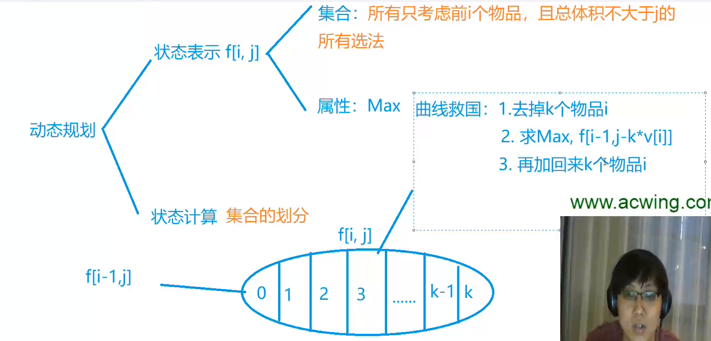
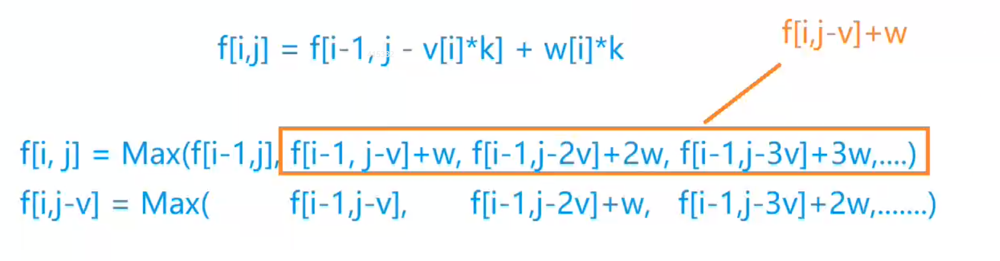

# 背包问题

## 目录

- [1. 背包问题0/1](#1-背包问题01)
  - [1.1 问题](#11-问题)
  - [1.2 抽象问题](#12-抽象问题)
  - [1.3 朴素方法](#13-朴素方法)
  - [1.4 优化](#14-优化)
- [2. 完全背包问题](#2-完全背包问题)
  - [2.1 问题](#21-问题)
  - [2.2 抽象问题](#22-抽象问题)
  - [2.3 朴素代码](#23-朴素代码)
  - [2.4 二维做法](#24-二维做法)
  - [2.5 一维做法 ](#25-一维做法-)
- [3. 多重背包问题](#3-多重背包问题)
  - [3.1 朴素做法](#31-朴素做法)
  - [3.2 二进制优化](#32-二进制优化)

# 1. 背包问题0/1

## 1.1 问题

有 N件物品和一个容量是V的背包。每件物品只能使用一次。

第 i件物品的体积是vi，价值是wi。

求解将哪些物品装入背包，可使这些物品的总体积不超过背包容量，且总价值最大。 &#x20;
输出最大价值。

## 1.2 抽象问题

定义f\[i]\[j]：只在前i个物品中选择，在总体积是j的情况下，总价值最大是多少。

答案为：$result =\max \{f[n][0 \sim v]\} \mid$

对于f\[i]\[j]:

1. 不选第i个物品，则$f[i][j]=f[i-1][j]$;
2. 选第i个物品，则$f[i][j]=f[i-1][j-weight[i]]+value[i]$

$f[0][0]=0$

## 1.3 朴素方法

```c++
#include<iostream>
#include<cstring>
#include<algorithm>

using namespace std;

int f[1010][1010];
int volum[1010], worth[1010];
int n, v;

int main()
{
    cin >> n >> v;
    for (int i = 1; i <= n; i++)
        cin >> volum[i] >> worth[i];

    for (int i = 1; i <= n; i++)
        for (int j = 1; j <= v; j++)
        {
            //两种情况
            if (j - volum[i] < 0)
                f[i][j] = f[i - 1][j];
            else
                f[i][j] = max(f[i - 1][j], f[i - 1][j - volum[i]] + worth[i]);
        }
    cout << f[n][v] << endl;
}


```

## 1.4 优化

首先可以去掉i这一维，重复使用f数组计算前i个物品的最大value。但是如果不做其他变化，那么就会变成$f[i][j]=f[i][j-volum[i]]+worth[i]$。因为f\[j-volum\[i]] 之前更新过，所以不能使用更新过的，要先使用旧的f数组，所以要将j反着算。

```c++
#include<iostream>
#include<cstring>
#include<algorithm>

using namespace std;

int f[1010];
int volum[1010], worth[1010];
int n, v;

int main()
{
    cin >> n >> v;
    for (int i = 1; i <= n; i++)
        cin >> volum[i] >> worth[i];

    for (int i = 1; i <= n; i++)
        for (int j = v; j >= 1; j--)
        {
            //两种情况
            if (j - volum[i] < 0)
                f[j] = f[j];
            else
                f[j] = max(f[j], f[j - volum[i]] + worth[i]);
        }
    cout << f[v] << endl;
}


```

# 2. 完全背包问题

## 2.1 问题

每种物品可以取无限次。

## 2.2 抽象问题



## 2.3 朴素代码

```c++
#include<iostream>
#include<cstring>
#include<algorithm>

using namespace std;

int n, v;
int volum[1010], worth[1010];
int f[1010][1010];


int main()
{
  cin >> n >> v;
  for (int i = 1; i <= n; i++)
    cin >> volum[i] >> worth[i];

  f[0][0] = 0;
  for (int i = 1; i <= n; i++)
    for (int j = 0; j <= v; j++)
      for (int k = 0; k * volum[i] <= j; k++)
      {
        f[i][j] = max(f[i][j], f[i - 1][j - k * volum[i]] + k * worth[i]);
      }

  cout << f[n][v] << endl;
}
```

## 2.4 二维做法



```c++
#include<iostream>
#include<cstring>
#include<algorithm>

using namespace std;

int n, v;
int volum[1010], worth[1010];
int f[1010][1010];


int main()
{
  cin >> n >> v;
  for (int i = 1; i <= n; i++)
    cin >> volum[i] >> worth[i];

  f[0][0] = 0;
  for (int i = 1; i <= n; i++)
    for (int j = 0; j <= v; j++)
    {
      f[i][j] = f[i - 1][j];
      if (volum[i] <= j)
        f[i][j] = max(f[i - 1][j], f[i][j - volum[i]] + worth[i]);
    }

  cout << f[n][v] << endl;
}
```

## 2.5 一维做法&#x20;

可以消去i，和0/1背包问题一样。但是这里要注意，因为0/1背包问题是从i-1层转移到i层，所以遍历体积需要倒序，但是完全背包问题是从i层转移到i层，所以正序遍历体积。

```c++
#include<iostream>
#include<cstring>
#include<algorithm>

using namespace std;

int n, v;
int volum[1010], worth[1010];
int f[1010];


int main()
{
  cin >> n >> v;
  for (int i = 1; i <= n; i++)
    cin >> volum[i] >> worth[i];

  f[0] = 0;
  for (int i = 1; i <= n; i++)
    for (int j = volum[i]; j <= v; j++)
    {
      f[j] = max(f[j], f[j - volum[i]] + worth[i]);
    }

  cout << f[v] << endl;
}
```

# 3. 多重背包问题

有$N$种物品和一个容量是$V$的背包。

第$i $种物品最多有$s_i $件，每件体积是$v_i $，价值是$w_i$。

求解将哪些物品装入背包，可使物品体积总和不超过背包容量，且价值总和最大。

## 3.1 朴素做法

和前面一样，就是k多了一个限制条件。

```c++
#include<iostream>
#include<cstring>
#include<algorithm>

using namespace std;

int n, v;
int volum[110], worth[110], s[110];
int f[110][110];


int main()
{
  cin >> n >> v;
  for (int i = 1; i <= n; i++)
    cin >> volum[i] >> worth[i] >> s[i];

  for (int i = 1; i <= n; i++)
    for (int j = 0; j <= v; j++)
      for (int k = 0; k * volum[i] <= j && k <= s[i]; k++)
      {
        f[i][j] = max(f[i][j], f[i - 1][j - k * volum[i]] + k * worth[i]);
      }

  cout << f[n][v] << endl;
}
```

## 3.2 二进制优化

假设现在第i个物品有200个，如果按照朴素做法，我需要从0枚举到200个。

但是，我可以先将200分成：0，1，2，4，8，...，64，200-127。通过在这9个数中任意选择若干个并加起来，就可以凑成0-200中任意一个数。证明：

0，1：0\~1

0，1，2：0\~1与2\~3⇒0\~3

0，1，2，4：0\~3与4\~7⇒0\~7

我现在将200分成了9个“新的物品”，每个物品只能选一次。那么n种物品，每种物品$s_i$个的问题转化为：$\sum_{1}^{n} \log S_{i}$种物品，每种物品只能选一个。这是0/1背包问题。

这道题要注意开辟数组的大小为$\sum_{1}^{n} \log S_{i}$

```c++
#include<iostream>
#include<cstring>
#include<algorithm>

using namespace std;

int n, v;
int volum[12010], worth[12010];
int f[12010];


int main()
{
  int cnt = 0;
  cin >> n >> v;
  for (int i = 1; i <= n; i++)
  {
    int temp_volum, temp_worth, temp_num;
    cin >> temp_volum >> temp_worth >> temp_num;
    
    //分割物品
    int k = 1;
    while (k <= temp_num)
    {
      cnt++;
      volum[cnt] = k * temp_volum;
      worth[cnt] = k * temp_worth;
      temp_num -= k;
      k *= 2;
    }
    if (temp_num > 0)
    {
      cnt++;
      volum[cnt] = temp_num * temp_volum;
      worth[cnt] = temp_num * temp_worth;
    }
  }

  for (int i = 1; i <= cnt; i++)
    for (int j = v; j >= volum[i]; j--)
    {
      f[j] = max(f[j], f[j - volum[i]] + worth[i]);
    }

  cout << f[v] << endl;
  return 0;
}


```

\#include\<iostream>

\#include\<cstring>

\#include\<algorithm>

using namespace std;

int n, v;

int volum\[12010], worth\[12010];

int f\[12010];

int main()

{

int cnt = 0;

cin >> n >> v;

for (int i = 1; i <= n; i++)

{

int temp\_volum, temp\_worth, temp\_num;

cin >> temp\_volum >> temp\_worth >> temp\_num;

//分割物品

int k = 1;

while (k <= temp\_num)

{

cnt++;

volum\[cnt] = k \* temp\_volum;

worth\[cnt] = k \* temp\_worth;

temp\_num -= k;

k \*= 2;

}

if (temp\_num > 0)

{

cnt++;

volum\[cnt] = temp\_num \* temp\_volum;

worth\[cnt] = temp\_num \* temp\_worth;

}

}

for (int i = 1; i <= cnt; i++)

for (int j = v; j >= volum\[i]; j--)

{

f\[j] = max(f\[j], f\[j - volum\[i]] + worth\[i]);

}

cout << f\[v] << endl;

return 0;

}
