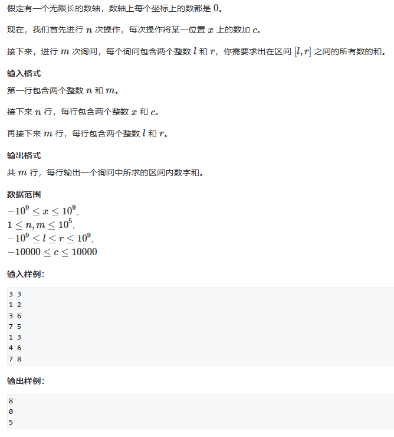

# 7 离散化

# 1. 算法思想

离散化处理需要先开辟一个小一点的数组，然后将需要用到的原数组索引存到这个新的数组里，这样原数组的索引和新数组的索引就形成了对应关系。假如，原数组需要用到索引为2，6，100的数据，我们就先开一个长度为3的数组ha，令ha\[0]=2，ha\[1]=6，ha\[2]=100。这样就形成了索引对应，但是新数组中可能有重复数据，并且是无序的，所以我们要进行去重并排序。这样，就可以随意查找原数组索引为x对应新数组的索引（因为新数组为有序的，所以只需要二分查找就可以找到）。然后我们可以再建一个数组a\[n]，存原数组的元素。

综上，离散化流程如下：首先通过ha数组存储原数组的索引，将新数组的索引和原数组的索引一一对应，然后将原数组索引对应的数据存入a数组。这样要想访问原数组索引为idx的元素，首先查找idx所对应新数组下标left，然后访问a\[left]就可以得出原数组元素。

```c++
int discretization(vector<int> a, int x)
{
  sort(a.begin(), a.end());
  a.erase(unique(a.begin(), a.end()), a.end());
  int l = 0, r = a.size() - 1;
  while (l < r)
  {
    int mid = l + r + 1 >> 1;
    if (x < a[mid])
      r = mid + 1;
    else
      l = mid; 
  }
  return l;
}

```

# 2. 模板题



```c++
#include<iostream>
#include<vector>
#include <algorithm>

using namespace std;

int n, m;
vector<vector<int>> add;
vector<vector<int>> query;
vector<int> mapping;
long long cnt[500010];


int hash_map(int x)
{
    int l = 0, r = mapping.size() - 1;
    while (l < r)
    {
        int mid = l + r >> 1;
        if (mapping[mid] < x)
            l = mid + 1;
        else
            r = mid;
    }
    return l;
}


int main()
{
    cin >> n >> m;
    for (int i = 0; i < n; i++)
    {
        int x, c;
        cin >> x >> c;
        add.push_back({ x, c });
        mapping.push_back(x);
    }
    for (int i = 0; i < m; i++)
    {
        int l, r;
        cin >> l >> r;
        query.push_back({ l - 1, r });
        mapping.push_back(l - 1);
        mapping.push_back(r);
    }

     sort(mapping.begin(), mapping.end()); 
    mapping.erase(unique(mapping.begin(), mapping.end()), mapping.end());
    for (int i = 0; i < n; i++)
    {
        cnt[hash_map(add[i][0])] += add[i][1];
    }
    for (int i = 1; i < mapping.size(); i++)
    {
        cnt[i] = cnt[i - 1] + cnt[i];
    }
        

    for (int i = 0; i < m; i++)
    {
        cout << cnt[hash_map(query[i][1])] - cnt[hash_map(query[i][0])] << endl;
    }
}


```
