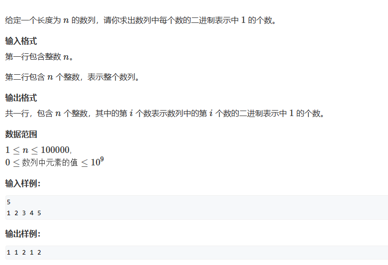

# 位运算



# 1. 右移判断

通过将二进制数字不断右移1位，并将个位与1相与，判断是否为1.

```c++
#include<iostream>
using namespace std;

int n;

int main()
{
    cin >> n;
    while(n--)
    {
        int x;
        int cnt = 0;
        cin >> x;
        while(x)
        {
            if(x & 1)
                cnt++;
            x = x >> 1;
        }
        cout << cnt << " ";
    }
    return 0;
}
```

# 2. lowbit

lowbit(x) = x中最低位的1与1后面的0拼起来的数，具体实现为：x & -x，解释参照：

[【位运算】深入理解并证明 lowbit 运算 \_#define lowbit(x) (x & (-x))-CSDN博客](https://blog.csdn.net/lesileqin/article/details/102418143 "【位运算】深入理解并证明 lowbit 运算_#define lowbit(x) (x & (-x))-CSDN博客")

```c++
#include<iostream>
using namespace std;

int n;

int lowbit(int x)
{
    return x & -x;
}

int main()
{
    cin >> n;
    while(n--)
    {
        int x;
        int cnt = 0;
        cin >> x;
        while(x)
        {
            x -= lowbit(x);
            cnt++;
        }
        cout << cnt << " ";
    }
    return 0;
}
```
