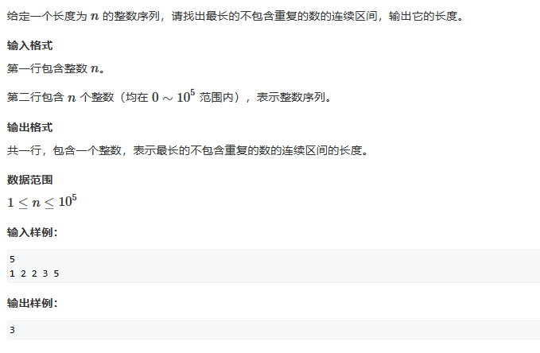
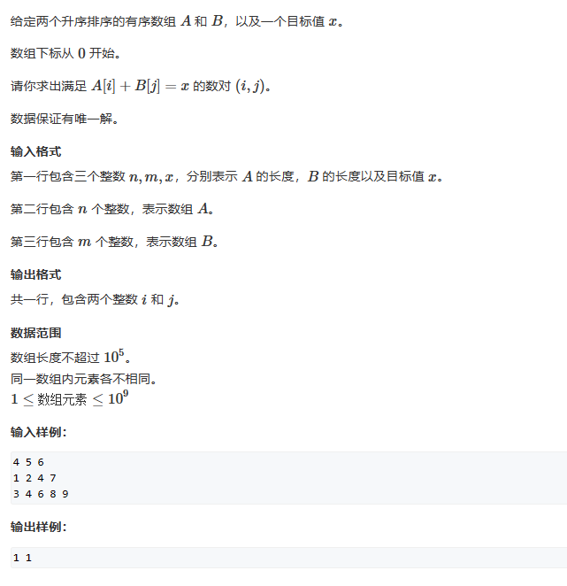
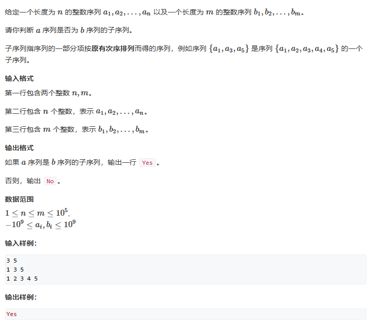

# 双指针算法

# 1. 最长连续不重复子序列



```c++
#include<iostream>
using namespace std;

int n;
int a[100010];
int cnt[100010];


int main()
{
    cin>>n;
    for(int i=0;i<n;i++)
        cin>>a[i];
    
    int len=0;
    for(int i=0, j=0;j<n;j++)
    {
        cnt[a[j]]++;
        while(cnt[a[j]]>1)
        {
            cnt[a[i]]--;
            i++;
        }
        len=max(len, j-i+1);
    }
    
    cout<<len<<endl;
}
```

# 2. 数组元素的目标和



```c++
#include<iostream>
using namespace std;

int a[100010];
int b[100010];
int n,m,x;


int main()
{
    cin>>n>>m>>x;
    for(int i=0;i<n;i++)
        cin>>a[i];
    for(int i=0;i<m;i++)
        cin>>b[i];
        
    for(int i=0,j=m-1;i<n;i++)
    {
        while(j>=0&&a[i]+b[j]>x)
            j--;
        if(j>=0l&&a[i]+b[j]==x)
        {
            cout<<i<<" "<<j<<endl;
            break;
        }
    }
    
    return 0;
}
```

# 3. 判断子序列



```c++
#include<iostream>
using namespace std;

int a[100010];
int b[100010];
int n,m;


int main()
{
    cin>>n>>m;
    for(int i=1;i<=n;i++)
        cin>>a[i];
    for(int i=1;i<=m;i++)
        cin>>b[i];
    
    int i,j;
    for(int i=1,j=1;i<=n;i++,j++)
    {
        while(a[i]!=b[j])
        {
            j++;
            if(j>m)
            {
            cout<<"No"<<endl;
            return 0;
            }
        }
    }
    cout<<"Yes"<<endl;
}
```
