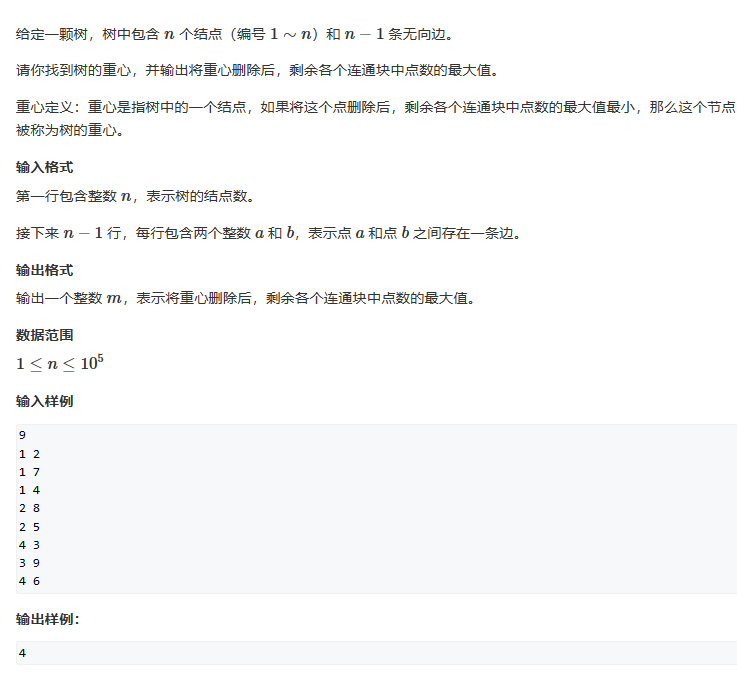
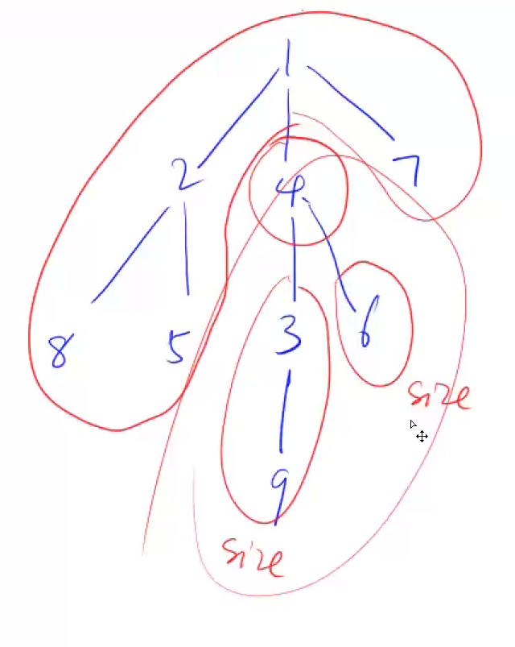

# 1. 搜索

# 1. 深度优先搜索

```c++
void dfs(int path[], bool visited[], int n, int u)
{
  if (u == n)
    path[u] = n;
  for (int i = 1; i <= n; i++)
  {
    if (visited[i] == false)
    {
      path[u] = i;
      visited[i] = true;
      dfs(path, visited, n, u + 1);
      //回溯
      u--;
      visited[i] = false;
    }
  }
}
```

# 2. 宽度优先搜索

```c++
void bfs(int n, int next[])
{
  queue<int> q;
  int visited[MAX_NUM];
  visited[1] = 0;

  while (q.size())
  {
    int t = q.front();
    q.pop();

    for (int i = t; i != -1; i = next[i])
    {
      if (!visited[i])
      {
        visited[i] = true;
        q.push(i);
      }
    }
  }
}
```

# 3.树的重心

## 3.1 题目



## 3.2 题解



上图中删掉4，我们可以将图看成两部分，第一部分是删掉4生成的两个子树，第二部分是整颗树剩下的部分。我们深度遍历生成的两个子树，在用整颗树减去生成的两个树的节点数和4这个节点，就是第二部分的节点数。然后再求最大值，就是删去4的子树中节点最大值。

这题只需要做一次深度优先遍历，因为在一次遍历过程中，会访问到所有节点；我们假设删去遍历到的这个节点，然后继续递归dfs，这样递归返回的依次数值为：以当前节点为根的所有子树的节点数。这样我们就可以计算出删除这个节点后，剩余各个连通块中节点数的最大值，并记录下来。

同时在递归dfs时，其各个子树的最大值也已经计算完成。例如计算删除4的连通块的最大值时，删除3和删除6的连通块最大值已经在递归中计算完成了。

## 3.3 代码

```c++
#include<iostream>
using namespace std;


int h[100010];
int ne[200010];
int e[200010];
int idx = 0;
int n;
bool visited[100010];
int ans = 1e9;


void add(int x, int y)
{
  e[idx] = y;
  ne[idx] = h[x];
  h[x] = idx;
  idx++;
}


int dfs(int x)
{
  visited[x] = true;
  int res = 0;
  int sum = 1;
  for (int i = h[x]; i != -1; i = ne[i])
  {
    if (visited[e[i]] == false)
    {
      int s = dfs(e[i]);    //s为删除e[i]后，生成的子树节点总数。
      sum += s;
      res = max(res, s);
    }
  }
  res = max(res, n - sum);
  ans = min(res, ans);
  return sum;
}


int main()
{
  cin >> n;
  int x, y;
  for (int i = 1; i <= n; i++)
  {
    h[i] = -1;
  }
  for (int i = 1; i <= n - 1; i++)
  {
    cin >> x >> y;
    add(x, y);
    add(y, x);
  }
  dfs(1);
  cout << ans << endl;

  return 0;
}
```
