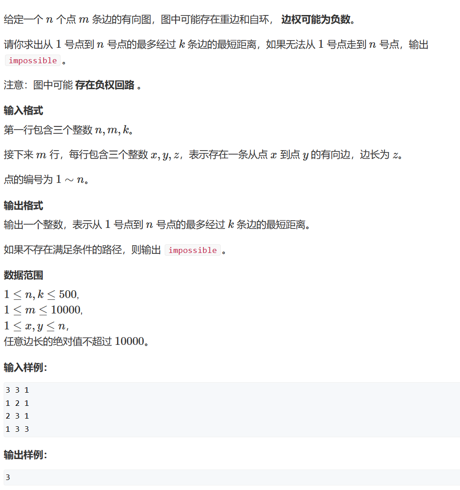
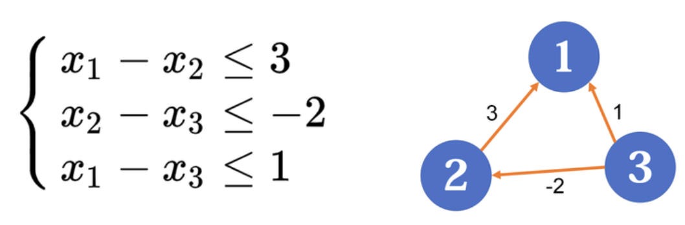
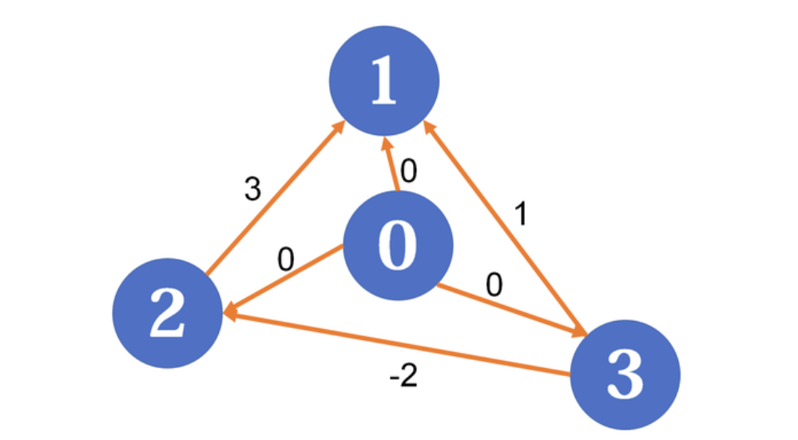

# 2. 最短路径

## 目录

- [1.dijkstra搜索](#1dijkstra搜索)
  - [1.1 dijkstra堆优化搜索（邻接矩阵）](#11-dijkstra堆优化搜索邻接矩阵)
- [2. bellman-ford算法](#2-bellman-ford算法)
  - [2.1 题目](#21-题目)
  - [2.2 代码](#22-代码)
- [3. spfa算法](#3-spfa算法)
- [4. spfa算法判断负环](#4-spfa算法判断负环)
- [5. floyd算法](#5-floyd算法)
- [6. 差分约束](#6-差分约束)


# 1.dijkstra搜索

这个算法对点进行操作。每次找到距离源点最近的点，即dist\[i]最小的点。

## 1.1 dijkstra堆优化搜索（邻接矩阵）

```c++
int dijkstra_list_priority_queue(int e[], int next[], int head[], int weight[], int n)
{
  int distance[MAX_NUM];
  int visited[MAX_NUM];
  memset(distance, INFINITY, sizeof distance);
  memset(visited, false, sizeof visited);
  distance[1] = 0;//别忘了初始化
  priority_queue < PII, vector<PII>, greater<PII>> heap;
  heap.push({ 0, 1 });

  while (heap.size())
  {
    auto t = heap.top();
    heap.pop();
    int ver = t.second;
    int dist = t.first;
    if (visited[ver] == true)
      continue;

    visited[ver] = true;
    for (int i = head[ver]; i != -1; i = next[i])
    {
      if (distance[e[i]] > dist + weight[i])
      {
        distance[e[i]] = dist + weight[i];
        //注意这里不要判断state再入队列，直接入队列！！！
        heap.push({ distance[e[i]], e[i] });
      }  
    }
  }

  if (distance[n] == 0x3f3f3f3f)
    return -1;
  else
    return distance[n];
}
```

# 2. bellman-ford算法

这个算法的作用对象是边。bellman-ford具体思路为：从源点开始，每次扩展一条边。具体的，对所有的边进行n-1轮松弛操作，因为在一个含有n个顶点的图中，任意两点之间的最短路径最多包含n-1边。换句话说，第1轮在对所有的边进行松弛后，得到的是源点最多经过1条边到达其他顶点的最短距离；第2轮在对所有的边进行松弛后，得到的是源点最多经过2条边到达其他顶点的最短距离。

## 2.1 题目



## 2.2 代码

```c++
#include<iostream>
#include<vector>
#include<queue>
using namespace std;
#define MAX_DISTANCE 0x3f3f3f3f
typedef pair<int, int> PII;


struct Edge
{
  int x;
  int y;
  int w;
};


int n, m, k;
int h[510];
int e[100010];
int weight[100010];
int ne[100010];
int dist[100010];
int idx = 0;
bool visited[100010];
Edge edges[100010];
int back[100010]; 


void bellman_ford()
{
  dist[1] = 0;
  for (int i = 0; i < k; i++)
  {
    // 目标放在第一个参数
    memcpy(back, dist, sizeof back);
    for (int i = 1; i <= m; i++)
    {
      int x = edges[i].x;
      int y = edges[i].y;
      int w = edges[i].w;
      if (dist[y] > back[x] + w)
      {
      //这里使用back的原因是，在本轮循环中，必须使用上一轮得到的dist。
      //如果使用本轮更新后的dist[y]，再去更新别人。相当于选了两条边。
        dist[y] = back[x] + w;
      }
    }
  }

  if (dist[n] >= MAX_DISTANCE / 2)
  {
    cout << "impossible" << endl;
    return;
  }
  else
    cout << dist[n] << endl;
}


int main()
{
  cin >> n >> m >> k;
  memset(dist, 0x3f, sizeof dist);
  memset(back, 0x3f, sizeof back);
  for (int i = 1; i <= m; i++)
  {
    cin >> edges[i].x >> edges[i].y >> edges[i].w;
  }
  bellman_ford();
}
```

# 3. spfa算法

使用队列对bellman-ford算法改进，因为一个点只有第n轮被更新后，才可能在第n+1轮更新其周围的点。所以我们要记录每轮被更新的点，这样在下一轮只需要测试这些点相连的边能否更新周围的点。

算法和dijkstra算法主要的区别是，此算法中每一个点可以重复更新。但是dijkstra算法是贪心的，一个节点如果加入，就不能被更新，所以dijkstra不能处理有负边的问题。

```c++
int spfa(int e[], int next[], int head[], int weight[], int n)
{
  int distance[MAX_NUM];
  memset(distance, INFINITY, sizeof distance);
   distance[1] = 0; 
  bool visited[MAX_NUM];
  memset(visited, false, sizeof visited);
  visited[1] = true;
  queue<int> heap;
  heap.push(1);

  while (heap.size())
  {
    int t = heap.front();
    heap.pop();
     visited[t] = false; 
    for (int i = head[t]; i != -1; i = next[i])
    {
      if (distance[e[i]] > distance[t] + weight[i])
      {
        distance[e[i]] = distance[t] + weight[i];
        if (visited[e[i]] == false)
        {
          heap.push(e[i]);
          visited[e[i]] = true;
        }
      }  
    }
  }

  if (distance[n] == 0x3f3f3f3f)
    return -1;
  else
    return distance[n];
}
```

# 4. spfa算法判断负环

注意这里的dist\[i]不是从一个固定的起点出发到i的最短路径，而是从任意起点出发到i的最短路径。

```c++
int n;      // 总点数
int h[N], w[N], e[N], ne[N], idx;       // 邻接表存储所有边
int dist[N], cnt[N];        // dist[x]存储1号点到x的最短距离，cnt[x]存储1到x的最短路中经过的点数
bool st[N];     // 存储每个点是否在队列中

// 如果存在负环，则返回true，否则返回false。
bool spfa()
{
    // 不需要初始化dist数组
    // 原理：如果某条最短路径上有n个点（除了自己），那么加上自己之后一共有n+1个点，由抽屉原理一定有两个点相同，所以存在环。

    queue<int> q;
    for (int i = 1; i <= n; i ++ )
    {
        q.push(i);
        st[i] = true;
    }

    while (q.size())
    {
        auto t = q.front();
        q.pop();

        st[t] = false;

        for (int i = h[t]; i != -1; i = ne[i])
        {
            int j = e[i];
            if (dist[j] > dist[t] + w[i])
            {
                dist[j] = dist[t] + w[i];
                cnt[j] = cnt[t] + 1;
                if (cnt[j] >= n) return true;       // 如果从1号点到x的最短路中包含至少n个点（不包括自己），则说明存在环
                if (!st[j])
                {
                    q.push(j);
                    st[j] = true;
                }
            }
        }
    }

    return false;
}

```

# 5. floyd算法

```c++
void floyd(int graph[][MAX_NUM], int n)
{
  for (int k = 0; k < n; k++)
    for (int i = 0; i < n; i++)
      for (int j = 0; j < n; j++)
        if (graph[i][j] > graph[i][k] + graph[k][j])
          graph[i][j] = graph[i][k] + graph[k][j];
}
```

# 6. 差分约束

我们得到一组多元一次不等式（$y_{1}, y_{2}, \ldots, y_{n}$）：

$$
\left\{\begin{array}{l}x_{c_{1}}-x_{c_{1}^{\prime}} \leq y_{1} \\ x_{c_{2}}-x_{c_{2}^{\prime}} \leq y_{2} \\ \cdots \\ x_{c_{n}}-x_{c_{n}^{\prime}} \leq y_{n}\end{array}\right.
$$

我们现在需要求出一组x的解。

我们设$x_{1}-x_{2} \leq c$，移项得到$x_{1} \leq x_{2}+c$，这让我们联想到最短路径中的三角形不等式$\operatorname{dist}[u] \leq \operatorname{dist}[v]+w_{v, u}$，利用这个，我们可以把上面的不等式转化为图。对于每一个$x_{c_{i}}-x_{c_{i}^{\prime}} \leq y_{i}$，我们都从$c_{i}^{\prime}$到$c_{i}$建一条边，边权为$y_{i}$。例如：



但是问题并没有解决，因为我们没有源点。这时候，需要人为的加上源点，我们设立一个超级源点，它到所有点的距离为0，即：



现在我们以0号点为源点求各点的最短路即可。注意，这相当于了添加了以下约束条件（$x_0
 $=dist\[0]=0）：

$$
\left\{\begin{array}{l}x_{1}-x_{0} \leq 0 \\ x_{2}-x_{0} \leq 0 \\ x_{3}-x_{0} \leq 0\end{array}\right.
$$

所以所求的distance都小于等于0。

```c++
#include<iostream>
#include<algorithm>
#include<vector>
#include<queue>
#include<cstring>
using namespace std;


#define max_num 10100
#define INFINITY 0x3f   
typedef pair<int, int> PII;


int dist[max_num];
int head[max_num];
int e[max_num];
int ne[max_num];
int weight[max_num];
int idx = 0;
bool state[max_num];
int cnt[max_num];


void add(int a, int b, int w)
{
  e[idx] = b;
  ne[idx] = head[a];
  weight[idx] = w;
  head[a] = idx;
  idx++;
}


int main()
{
  int n, m;
  cin >> n >> m;
  memset(dist, INFINITY, sizeof dist);
  for (int i = 0; i <= n; i++)
  {
    head[i] = -1;
     //注意这里需要将超级源点和其他边连起来 
     if(i!=0)
      add(0, i, 0); 
  }
    

  for (int i = 0; i < m; i++)
  {
    int a, b, w;
    cin >> a >> b >> w;
    add(b, a, w);
  }  
  queue<int> que;
  que.push(0);
  state[0] = true;
  dist[0] = 0;

  while (que.size())
  {
    int t = que.front();
    que.pop();
    state[t] = false;

    for (int i = head[t]; i != -1; i = ne[i])
    {
      int j = e[i];
      if (dist[j] > dist[t] + weight[i])
      {
        cnt[j] = cnt[t] + 1;
        dist[j] = dist[t] + weight[i];
         //因为有超级源点，所以一共是n+1个节点 
         if (cnt[j] >= n + 1) 
        {
          cout << "NO" << endl;
          return 0;
        }
        if (state[j] == false)
        {
          que.push(j);
          state[j] = true;
        }
      }
    }
  }

  for (int i = 1; i <= n; i++)
    cout << dist[i] << " ";
}
```

以上只是满足$x_{1}, x_{2}, \ldots, x_{n} \leq w$的最大解（上面$w=0$），如果想要求$x_{1}, x_{2}, \ldots, x_{n} \geq w$的最小解，只需要求出最长路就行，最长路需要满足$\operatorname{dist}[u] \geq \operatorname{dist}[v]+w_{v, u}$，即将代码变成：

```c++
if (dist[j] < dist[t] + weight[i])       dist[j] = dist[t] + weight[i];
```

同时还需注意，初始化dist时需要初始成-INF。
