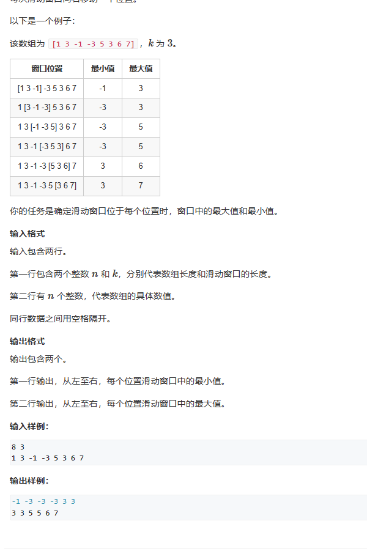

# 3单调队列

滑动窗口
输入包含两行。
第一行包含两个整数n和k，分别代表数组长度和滑动窗口的长度。
第二行有n个整数，代表数组的具体数值。
同行数据之间用空格隔开。



```c++
#include <iostream>
#include <cstring>
#include <algorithm>
#include <deque>
using namespace std;

const int N = 1000010;
int a[N];
int q[N];                    //存储队列下标
int head=0;
int tail=0;


int main()
{
    int n,k;
    cin>>n>>k;
    for(int i=1;i<=n;i++)
    {
        cin>>a[i];
    }
    
    for(int i=1;i<=n;i++)
    {
        //如果遍历到比窗口大的i时，就要判断队列头是否要出队列。
        // 如果队列头下标等于i-k，就证明队头元素是这个窗口之外的数，这个数要出队列
        if(head<tail&&i>k&&q[head]==i-k)
            head++;
        //如果队列不空，且队列中的数大于a[i]，证明队列中的数没用，出队列。
        while(head<tail&&a[q[tail-1]]>=a[i])        //注意这里是tail-1
            tail--;
        q[tail++]=i;
        //如果遍历个数i大于等于窗口大小，证明第一个窗口遍历完了，之后每个循环就应该输出队头的值了。
        if(i>=k)
            cout<<a[q[head]]<<" ";
    }
    head=tail=0;
    cout<<endl;
    
    for(int i=1;i<=n;i++)
    {
        if(head<tail&&i>k&&q[head]==i-k)
            head++;
        while(head<tail&&a[q[tail-1]]<=a[i])        //注意这里是tail-1
            tail--;
        q[tail++]=i;
        if(i>=k)
            cout<<a[q[head]]<<" ";
    }
}
```
