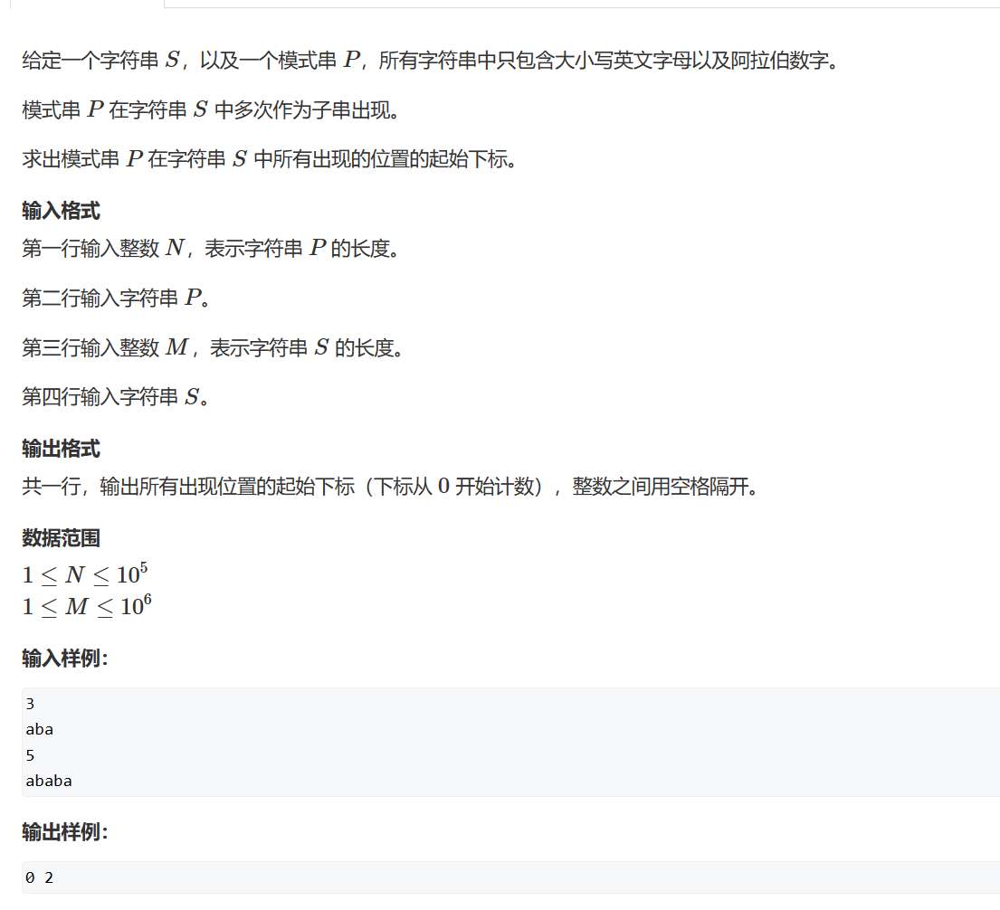

# 4 KMP算法



首先算出next数组，再计算匹配。

在进行操作时，是用p\[j+1]与s\[i]进行比较。如果匹配，那么j++，如果不匹配，那么j=ne\[j]。

```c++
#include<iostream>
using namespace std;

int n, m;
char p[100010];
char s[1000010];
int ne[100010];
  

int main()
{
    cin >> n;
    for (int i = 1; i <= n; i++)
        cin >> p[i];
    cin >> m;
    for (int i = 1; i <= m; i++)
        cin >> s[i];

    for (int i = 2, j = 0; i <= n; i++)
    {
        while (j && p[i] != p[j + 1])
            j = ne[j];
        if (p[i] == p[j + 1])
            j++;
        ne[i] = j;
    }

    for (int i = 1, j = 0; i <=m; i++)
    {
        while (j && s[i] != p[j + 1])
            j = ne[j];
        if (s[i] == p[j + 1])
            j++;
        if (j == n)
        {
            cout << i - n + 1 - 1 <<" ";            //从0开始
            j = ne[j];
        }
    }
}


```
