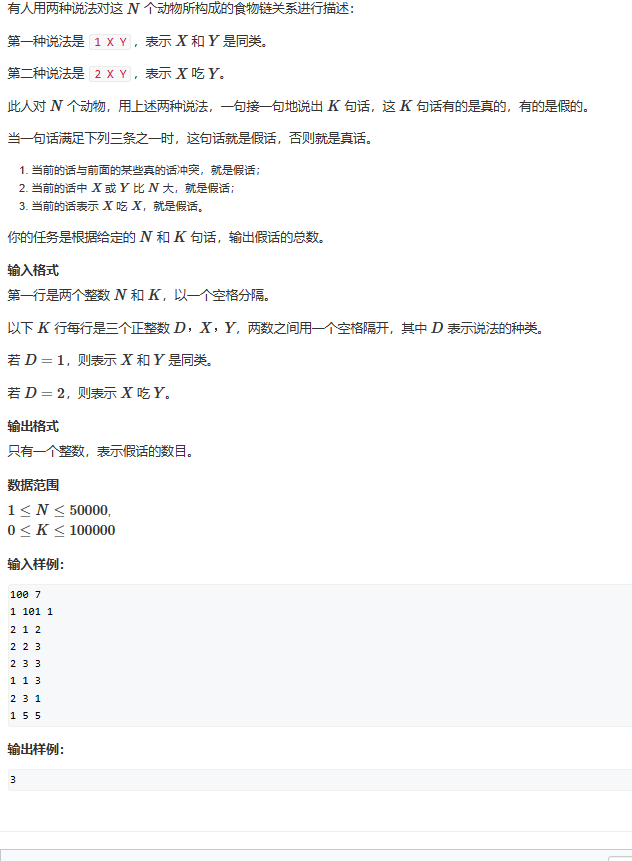
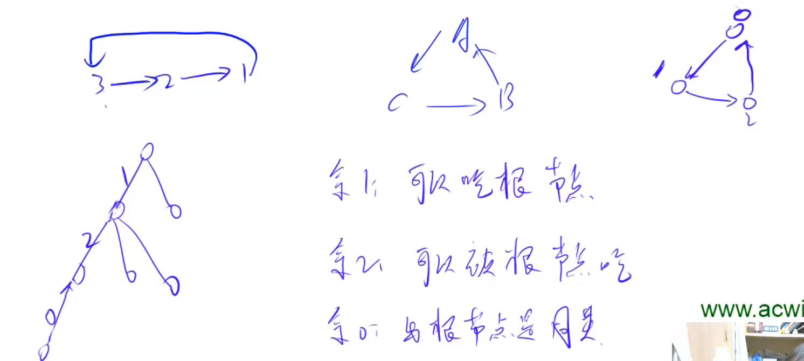

# 6 并查集

# 1.基本算法

## 1. 初始化并查集

```c++
void init_DSU(int p[], int n)
{
  for (int i = 0; i < n; i++)
    p[i] = i;
}
```

## 2. 查找

```c++
int find_DSU(int p[], int n, int x)
{
  if (x != p[x])
    p[x] = find_DSU(p, n, x);
  else
    return p[x];
}
```

## 3. 将集合a和b合并

**注意这里的插入是把a的根节点的父节点设为y的根节点**

```c++
void merge_DSU(int p[], int n, int a, int b)
{
  p[find_DSU(p, n, a)] = find_DSU(p, n, b);
}
```

# 2. 进阶

## 2.1 题目



## 2.2 题解

A吃B，B吃C，C吃A，这样ABC就构成了如下的环，如果将他们都并入一个集合，那么可以每个节点到根节点的距离判断节点之间的关系。例如，距离根节点距离为1的节点就可以被根节点吃，距离根节点为2的节点可以被距离为1的节点吃。假如根节点是A,那么距离为1的节点就是B，距离为2的节点就是C，如此循环下去，距离%3==0的节点和根节点同类，就是A，距离%3==1的节点为B，距离%3==2的节点为C。



在判断第一类语句时，首先判断x和y是否越界。

其次，判断x和y是否在同一个集合中，即px==py？如果相等，只需要判断d\[px]-d\[py]是否可以被3整除就行；如果不相等，就要把x所在的树和y所在的树合并，同时要确保合并后x和y是同一类，假设将px的父节点设为py，且px到py的距离为L，则要满足(d\[py]-(d\[px]+L))%3==0，所以L=d\[py]-d\[px]。

## 2.3 代码

```c++
#include<iostream>
using namespace std;

int n, k;
int ans = 0;
int p[100010];
int d[100010];


int find(int x)
{
    if (p[x] != x)
    {
        int t = find(p[x]);
        d[x] += d[p[x]];
        p[x] = t;
    }
    return p[x];
}


int main()
{
    cin >> n >> k;
    for (int i = 1; i <= n; i++)
        p[i] = i;

    while (k--)
    {
        int command, x, y;
        cin >> command >> x >> y;
        int px = find(x);
        int py = find(y);
        if (x > n || y > n)
        {
            ans++;
            continue;
        }
        if (command == 1)
        {
            if (px == py)
            {
                if ((d[y] - d[x]) % 3 != 0)
                    ans++;
            }
            else
            {
                p[px] = py;
                d[px] = d[y] - d[x];
            }
        }
        else
        {
            if (px == py)
            {
                if ((d[y] - d[x]) % 3 != 1&& (d[x] - d[y]) % 3 != 2)
                    ans++;
            }
            else
            {
                p[py] = px;
                d[py] = d[x] - d[y] + 1;
            }
        }
    }
    cout << ans << endl;
    return 0;
}


```
