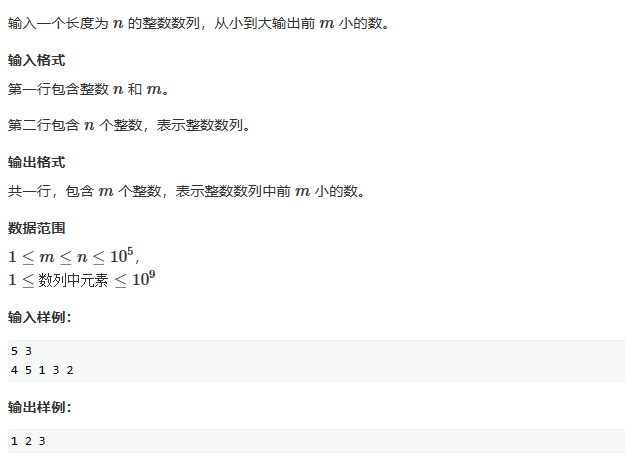
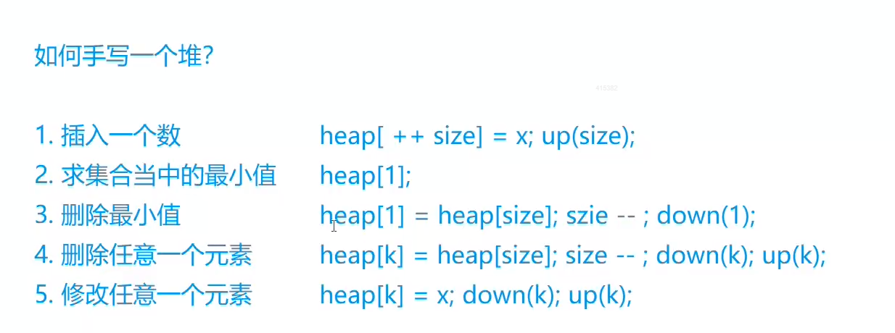

# 7 堆

# 1. 小顶堆



```c++
#include<iostream>
using namespace std;

int n, m;
int cnt;
int a[100010];


void down(int x)
{
    int t = x;
    //注意这里是t是因为：需要在两个儿子中找到一个最小的。
    if (x * 2 <= cnt && a[x * 2] <  a[t] )
        t = x * 2;
    if (x * 2 + 1 <= cnt && a[x * 2 + 1] <  a[t] )
        t = x * 2 + 1;
    if (t == x)
        return;
    else
    {
        swap(a[t], a[x]);
        down(t);
    }
}


int main()
{
    cin >> n >> m;
    for (int i = 1; i <= n; i++)
        cin >> a[i];
    cnt = n;

    for (int i = n / 2; i > 0; i--)
        down(i);

    while (m--)
    {
        cout << a[1] << " ";
        a[1] = a[cnt];
        cnt--;
        down(1);
    }
}
```

# 2. 模拟堆（普通版本）



# 2. 模拟堆

本题需要三个数组，h\[N], ph\[N], hp\[N]

ph\[N]的作用是根据第k个插入数的k下标，找到这个元素在堆中的下标。

hp\[N]的作用是根据堆中元素的下标，找到他是第几个插入的元素。
