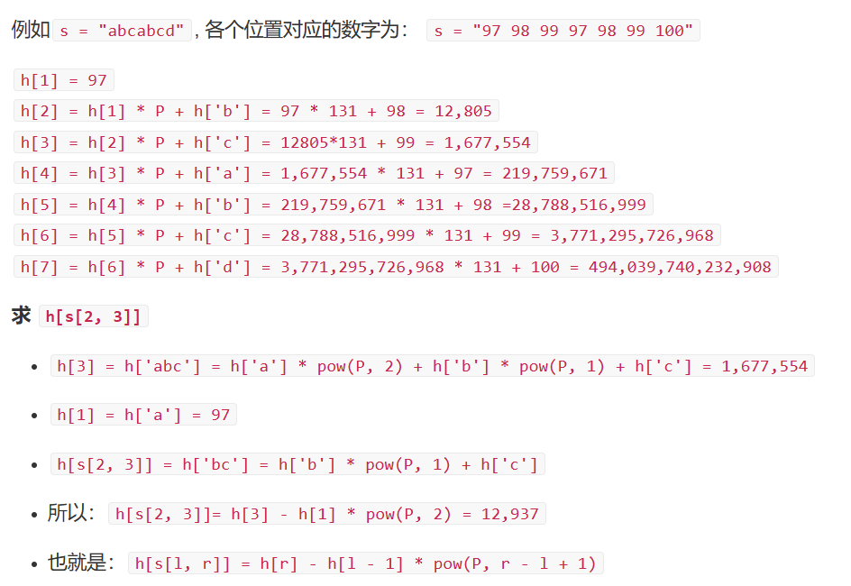

# 8 哈希

# 1. 拉链法

```c++
#include<iostream>
using namespace std;
#define N 10003

int n;
int h[100010], e[100010], ne[100010];
int idx = 0;


void insert(int x)
{
    //防止x%N为负数，所以要加上N
    int t =  (x % N + N) % N; 
    e[idx] = x;
    ne[idx] = h[t];
    h[t] = idx;
    idx++;
}


bool find(int x)
{
    int t = (x % N + N) % N;
    for (int i = h[t]; i != -1; i = ne[i])
        if (e[i] == x)
            return true;
    return false;
}


int main()
{
    cin >> n;
    for (int i = 0; i <= N; i++)
        h[i] = -1;
    while (n--)
    {
        char command;
        int x;
        cin >> command;
        cin >> x;
        if (command == 'I')
        {
            insert(x);
        }
        else
        {
            if (find(x))
                cout << "Yes" << endl;
            else
                cout << "No" << endl;
        }
    }
}
```

# 2. 开放地址法哈希

# 3. 字符串哈希

例如字符串ABCD，我们假设这是一个p进制的数，那么这个字符串的值就是$A \cdot p^{3}+B \cdot p^{2}+C \cdot p^{1}+D \cdot p^{0}$。所以，所有的字符串都可以表示为1个哈希值，在题目中设置p=131，模数Q=$2^{64}$。

因为是unsigned long long 是64位数字，所以用它存储哈希值，这样超出64位的数将会舍去，相当于做了一个模运算。

对于计算子串的哈希值，例如，从L到R的字串哈希值。我们需要先计算出从1\~L-1，1\~R（左边开始数）的哈希值h\[L-1]，h\[R]。（字符串右边是最低位）因为L-1这个字符串比R短R-L+1的长度，所以先$h[L-1] \cdot P^{R-L+1}$,使h\[L-1]和h\[R]长度相等，再相减即可。



```c++
#include<iostream>
using namespace std;
#define P 131

int n, m;
char str[100010];
unsigned long long hash_value[100010];
unsigned long long p[100010];


unsigned long long cal(int l, int r)
{
  return hash_value[r] - hash_value[l - 1] * p[r - l + 1];
}


int main()
{
  cin >> n >> m;
  p[0] = 1;
  for (int i = 1; i <= n; i++)
  {
    cin >> str[i];
    p[i] = p[i - 1] * P;
    hash_value[i] = hash_value[i - 1] * P + str[i];
  }
  while (m--)
  {
    int l1, r1, l2, r2;
    cin >> l1 >> r1 >> l2 >> r2;
    if (cal(l1, r1) == cal(l2, r2))
      cout << "Yes" << endl;
    else
      cout << "No" << endl;
  }
}
```
