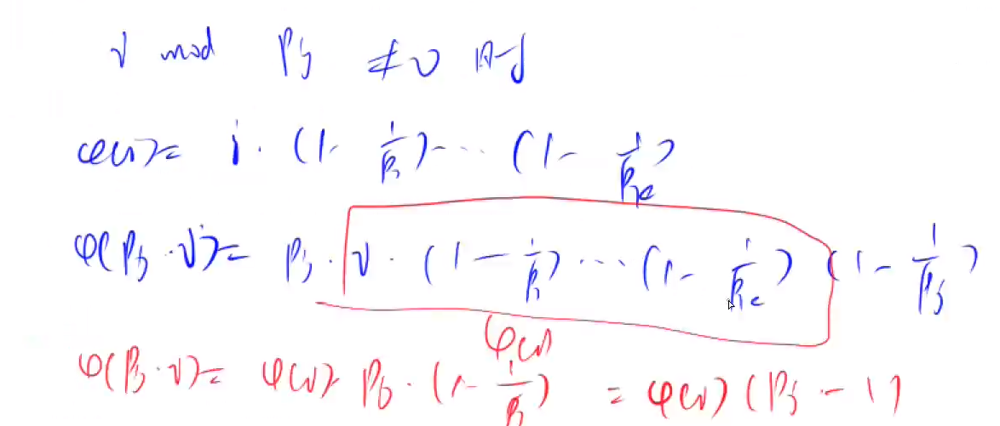

# 3. 欧拉函数

# 1. 欧拉函数

## 1.1 欧拉函数定义

1-n中与n互质的数的个数。

互质数含义：如果两个正整数a和b的最大公约数是1，那么我们称a与b互为质数。

## 1.2 欧拉公式

$$
\varphi(n)=\prod_{i=1}^{r} p_{i}^{k_{i}-1}\left(p_{i}-1\right)=\prod_{p \mid n} p^{\alpha_{p}-1}(p-1)=n \prod_{p \mid n}\left(1-\frac{1}{p}\right)
$$

## 1.3 代码

```c++
#include<bits/stdc++.h>
using namespace std;


int n;
int a;


void ola(int x)
{
    long long ans=x;
    vector<int> primes;
    for(int i=2;i<=x/i;i++)
    {
        if(x%i==0)
        {
            while(x%i==0)
                x/=i;
            primes.push_back(i);
        }
    }
    if(x>1)
        primes.push_back(x);
        
    for(int i=0;i<primes.size();i++)
        ans*=(1-1.0/primes[i]);
    cout<<ans<<endl;
}


int main()
{
    cin>>n;
    while(n--)
    {
        cin>>a;
        ola(a);
    }
}
```

## 2. 筛法求欧拉函数




```c++
long long ola_sum(int x)
{
  bool visited[MAX_NUM];
  long long phi[MAX_NUM];
  vector<int> primes;
  phi[1] = 1;
  for (int i = 2; i <= x; i++)
  {
    if (visited[i] == false)
    {
      phi[i] = i - 1;
      primes.push_back(i);
    }
    for (int j = 0; primes[j] <= x / i; j++)
    {
      visited[primes[j] * i] = true;
      if (i % primes[j] == 0)
      {
        phi[primes[j] * i] = phi[i] * primes[j];
        break;
      }
      phi[primes[j] * i] = phi[i] * (primes[j] - 1);
    }
  }

  long long ans = 0;
  for (int i = 1; i <= x; i++)
    ans += phi[i];
  return ans;
}
```
