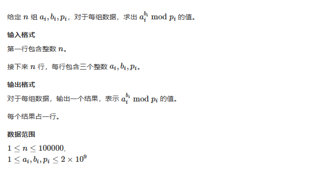
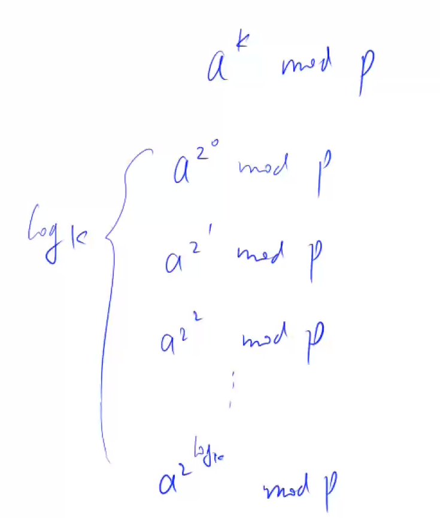
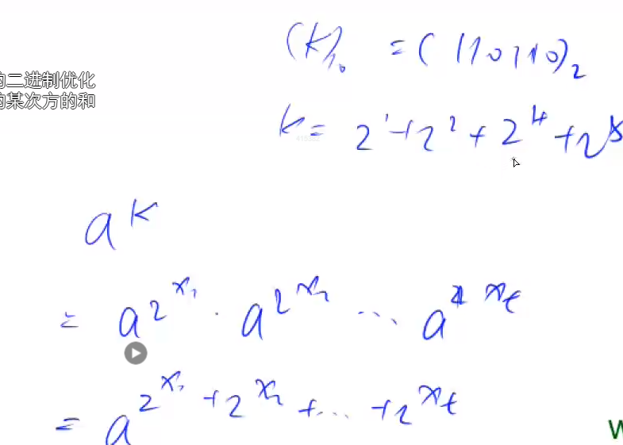
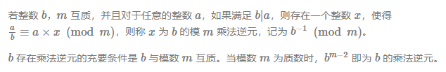

# 4. 快速幂

## 目录

- [1.快速幂算法](#1快速幂算法)
  - [1.1 首先计算下列数：](#11-首先计算下列数)
  - [1.2 其次将k拆分成二进制](#12-其次将k拆分成二进制)
  - [1.3 通过查表找到每一项，并相乘得到结果](#13-通过查表找到每一项并相乘得到结果)
  - [1.4 代码](#14-代码)
- [2. 快速幂求逆元](#2-快速幂求逆元)
  - [2.1 定义](#21-定义)
  - [2.2 代码](#22-代码)

# 1.快速幂算法



## 1.1 首先计算下列数：



## 1.2 其次将k拆分成二进制



## 1.3 通过查表找到每一项，并相乘得到结果

## 1.4 代码

```c++
#include<bits/stdc++.h>
using namespace std;


long long quick_power(int a,int b,int p)
{
    long long res=1;
    while(b)
    {
        if(b&1)
            res=(long long)res*a%p;
        b=b>>1;
        a=(long long)a*a%p;
    }
    return res;
}


int main()
{
    int n;
    cin>>n;
    while(n--)
    {
        int a,b,p;
        cin>>a>>b>>p;
        long long ans=quick_power(a,b,p);
        cout<<ans<<endl;
    }
}

```

# 2. 快速幂求逆元

## 2.1 定义



证明如下（费马定理）：

$$
\begin{array}{c}b^{m-1} \equiv 1(\bmod m) \\ b \cdot b^{m-2} \equiv 1(\bmod m) \\ \frac{a}{b} \cdot b \cdot b^{m-2} \equiv \frac{a}{b}(\bmod m) \\ a \cdot b^{m-2} \equiv \frac{a}{b}(\bmod m) \\ \therefore \quad x=b^{m-2}\end{array}
$$

如果b%m==0，，那么第一个式子就不成立，所以无解。

## 2.2 代码

```c++
#include<iostream>
using namespace std;


int quick_power(int a, int k, int p)
{
    long long ans = 1;
    while (k)
    {
        if (k & 1)
            ans = (long long)ans * a % p;
        k = k >> 1;
        a = (long long)a * a % p;
    }

    return ans;
}


int main()
{
    int n;
    cin >> n;
    while (n--)
    {
        int a, p;
        cin >> a >> p;
        if (a % p == 0)
            cout << "impossible" << endl;
        else
            cout << quick_power(a, p - 2, p) << endl;
    }
}
```
