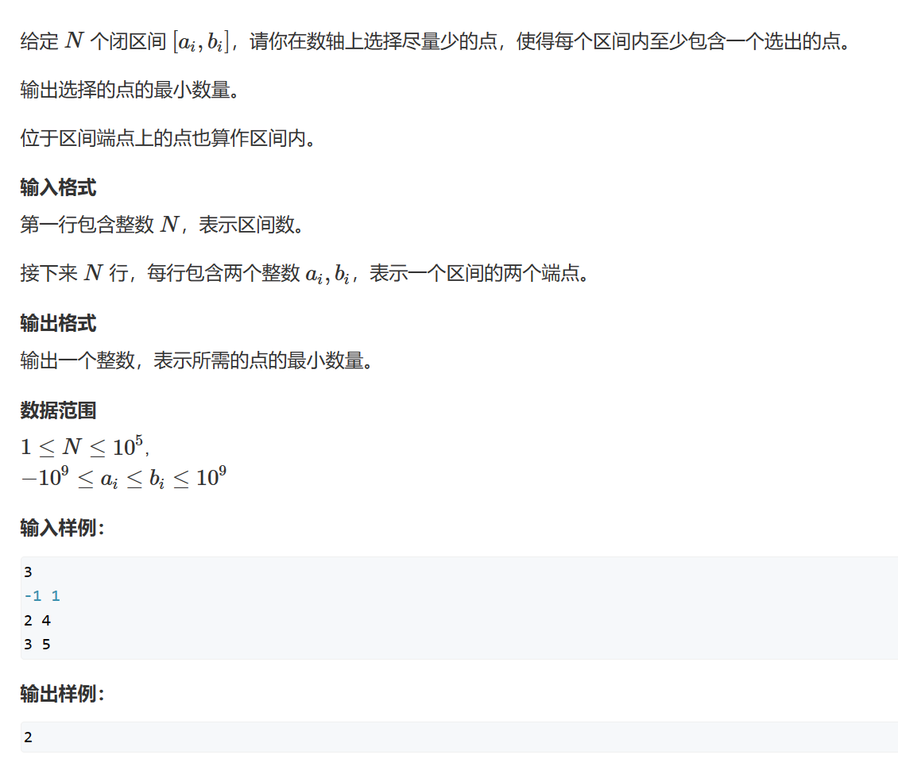
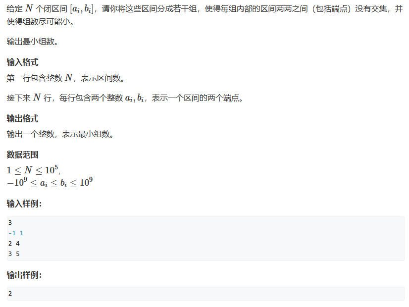
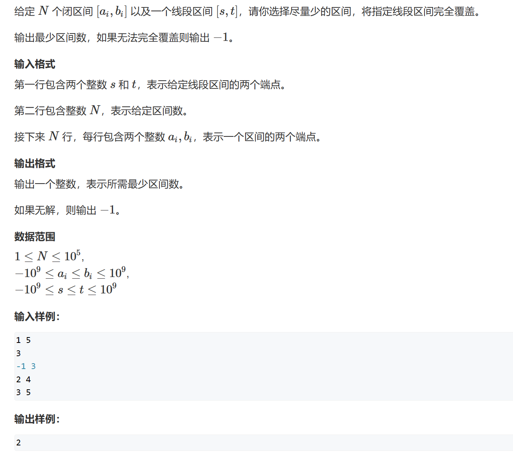

# 区间问题

# 1. 区间选点

## 1.1 题目



## 1.2 题解

在一段中最优选择是选择右端点，因为右端点可以尽可能覆盖更多的区间。

首先按照每段区间右端点升序排序。然后维护一个end记录现在的点覆盖到哪个区间了，要是当前区间没有被覆盖到，就选择此区间的右端点，即：使ans++，并扩大end。

```c++
#include<iostream>
#include<algorithm>
using namespace std;

int n;
struct Closure
{
  int left;
  int right;
};
Closure closure[100010];


bool cmp(Closure c1, Closure c2)
{
  return c1.right < c2.right;
}


int main()
{
  cin >> n;
  for (int i = 1; i <= n; i++)
  {
    int l, r;
    cin >> l >> r;
    closure[i].left = l;
    closure[i].right = r;
  }

  sort(closure + 1, closure + n + 1, cmp);

  int ans = 0;
  int end = -2e9;
  for (int i = 1; i <= n; i++)
  {
    if (closure[i].left > end)
    {
      ans++;
      end = closure[i].right;
    }
  }

  cout << ans << endl;
  return 0;
}
```

# 2. 最大不相交区间数量

和上题一样。

# 3. 区间分组

## 3.1 题目



## 3.2 题解

现在有k组，如果当前区间和所有组都有重合，那就新开一个组，把这个区间放进去。

```c++
#include<iostream>
#include<queue>
#include<algorithm>
using namespace std;

int n;
struct Range
{
  int left;
  int right;
};
Range range[100010];
priority_queue<int, vector<int>, greater<int>> que;

bool cmp(Range ra1, Range ra2)
{
  return ra1.left < ra2.left;
}

int main()
{
  cin >> n;
  for (int i = 1; i <= n; i++)
  {
    cin >> range[i].left >> range[i].right;
  }
  sort(range + 1, range + n + 1, cmp);

  for (int i = 1; i <= n; i++)
  {
    if (que.empty() || que.top() >= range[i].left)
    {
      que.push(range[i].right);
    }
    else
    {
      que.pop();
      que.push(range[i].right);
    }
  }

  cout << que.size() << endl;
  return 0;
}
```

# 4. 区间覆盖

## 4.1 题目



## 4.2 题解

选择可以包含start，且区间右端点最大的区间。然后，将区间的右端的作为新的start。

```c++
#include<iostream>
#include<queue>
#include<algorithm>
using namespace std;

int n;
int start, ed;
bool is_find = false;
struct Range
{
  int left;
  int right;
};
Range range[100010];

bool cmp(Range ra1, Range ra2)
{
  return ra1.left < ra2.left;
}

int main()
{
  cin >> start >> ed;
  cin >> n;
  for (int i = 1; i <= n; i++)
  {
    cin >> range[i].left >> range[i].right;
  }
  sort(range + 1, range + n + 1, cmp);

  int ans = 0;
  for (int i = 1; i <= n; i++)
  {
    int j = i;
    int max_right = -2e9;
    while (j <= n && range[j].left <= start)
    {
      max_right = max(max_right, range[j].right);
      j++;
    }
    if (max_right < start)
    {
      is_find = false;
      break;
    }
    ans++;
    if (max_right >= ed)
    {
      is_find = true;
      break;
    }
    start = max_right;
    i = j - 1;
  }

  if (is_find == false)
    cout << -1 << endl;
  else
    cout << ans << endl;
  return 0;
}
```
