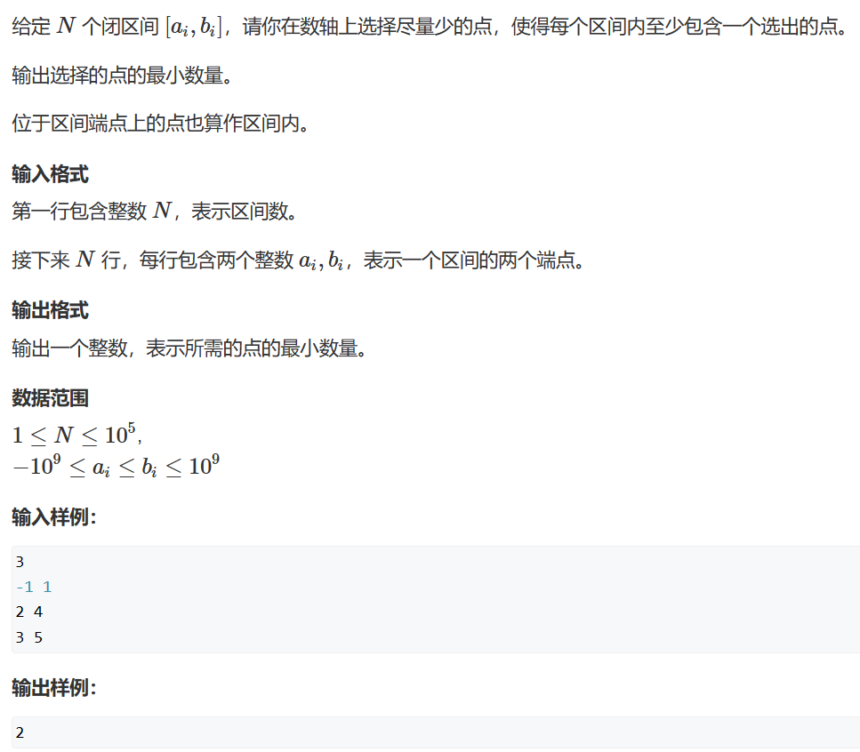
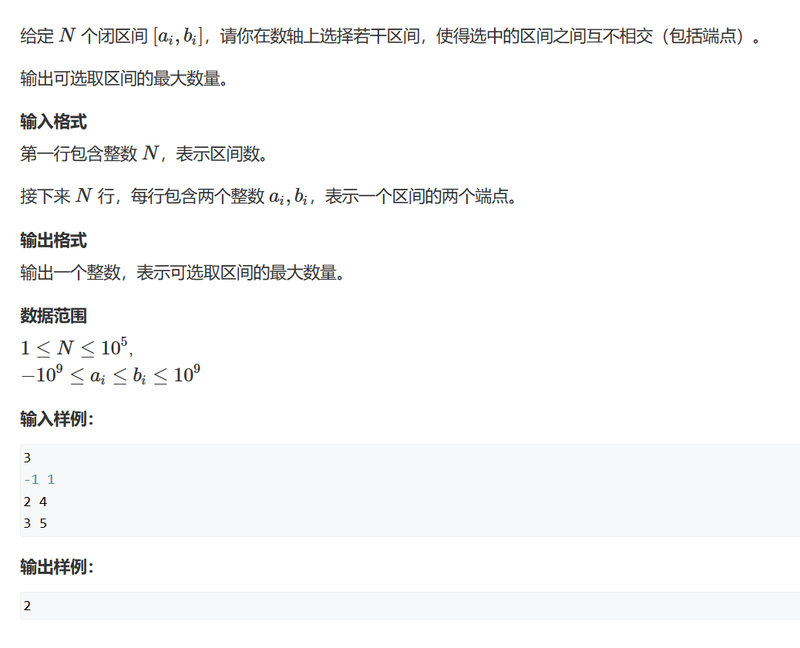
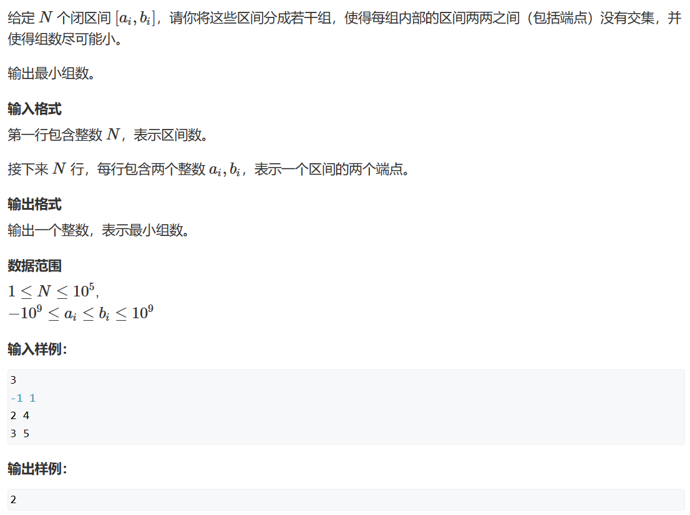
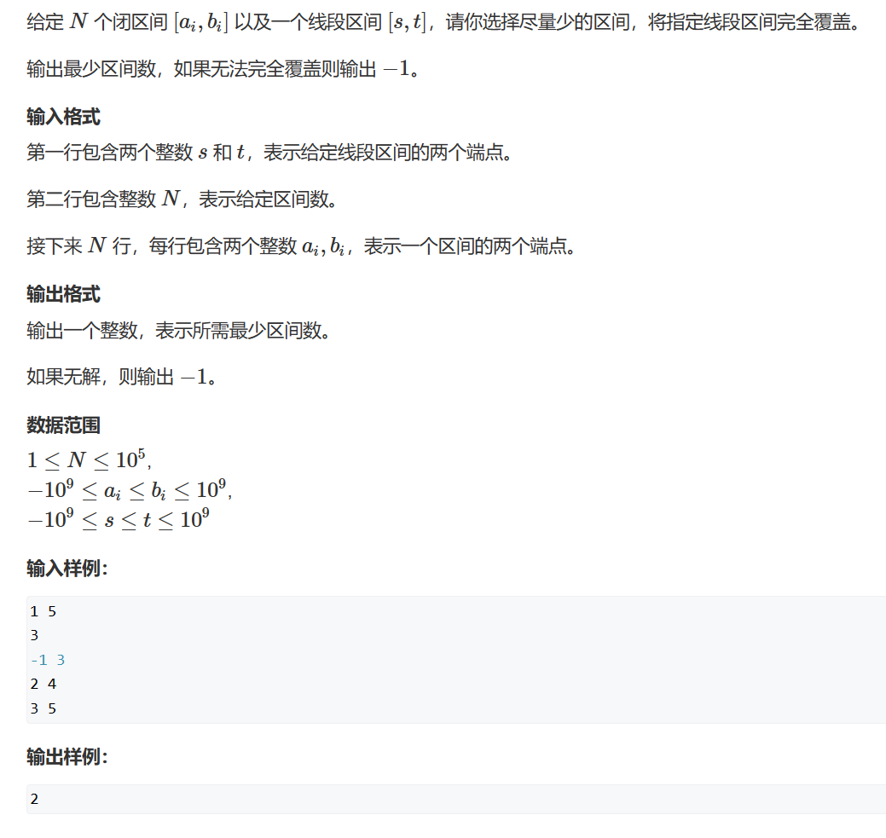

# 打印

# 1. 区间选点



```c++
#include<bits/stdc++.h>

using namespace std;


bool cmp(pair<int,int>a,pair<int,int>b){
  if(a.second==b.second)return a.first<b.first;
  return a.second<b.second;
}

int main()
{
  int n;
  cin>>n;
  vector<pair<int,int>> arr;
  while(n--){
    int a,b;
    cin>>a>>b;
    arr.push_back({a,b});
  }
  sort(arr.begin(),arr.end(),cmp);
  
//   
  // for(int i=0;i<arr.size();i++){
    // cout<<arr[i].first<<" "<<arr[i].second<<endl;
  // }
  
  int t=INT_MIN;
  int count=0;
  for(int i=0;i<arr.size();i++){
    if(arr[i].first<=t){
      continue;
    }else{
      count++;
      t=arr[i].second;
    }
  }
  cout<<count<<endl;
  
  
  
  return 0;
}
```

# 2.  最大不相交区间数量



```c++
#include<iostream>
#include<algorithm>
using namespace std; 

int n;
struct Closure
{
    int left;
    int right;
};
Closure closure[100010];

bool cmp(Closure c1, Closure c2)
{
    return c1.right<c2.right;
}

int main()
{
    cin>>n;
    for(int i=1;i<=n;i++)
    {
        cin>>closure[i].left;
        cin>>closure[i].right;
    }
    sort(closure+1, closure+n+1, cmp);
    
    int end=-2e9;
    int ans=0;
    for(int i=1;i<=n;i++)
    {
        if(closure[i].left>end)
        {
            ans++;
            end=closure[i].right;
        }
    }
    
    cout<<ans<<endl;
}


```

# 3. 区间分组



```c++
#include<iostream>
#include<queue>
#include<algorithm>
using namespace std;

int n;
struct Range
{
  int left;
  int right;
};
Range range[100010];
priority_queue<int, vector<int>, greater<int>> que;

bool cmp(Range ra1, Range ra2)
{
  return ra1.left < ra2.left;
}

int main()
{
  cin >> n;
  for (int i = 1; i <= n; i++)
  {
    cin >> range[i].left >> range[i].right;
  }
  sort(range + 1, range + n + 1, cmp);

  for (int i = 1; i <= n; i++)
  {
    if (que.empty() || que.top() >= range[i].left)
    {
      que.push(range[i].right);
    }
    else
    {
      que.pop();
      que.push(range[i].right);
    }
  }

  cout << que.size() << endl;
  return 0;
}
```

# 4. 区间覆盖



```c++
#include<iostream>
#include<queue>
#include<algorithm>
using namespace std;

int n;
int start, ed;
bool is_find = false;
struct Range
{
  int left;
  int right;
};
Range range[100010];

bool cmp(Range ra1, Range ra2)
{
  return ra1.left < ra2.left;
}

int main()
{
  cin >> start >> ed;
  cin >> n;
  for (int i = 1; i <= n; i++)
  {
    cin >> range[i].left >> range[i].right;
  }
  sort(range + 1, range + n + 1, cmp);

  int ans = 0;
  for (int i = 1; i <= n; i++)
  {
    int j = i;
    int max_right = -2e9;
    while (j <= n && range[j].left <= start)
    {
      max_right = max(max_right, range[j].right);
      j++;
    }
    if (max_right < start)
    {
      is_find = false;
      break;
    }
    ans++;
    if (max_right >= ed)
    {
      is_find = true;
      break;
    }
    start = max_right;
    i = j - 1;
  }

  if (is_find == false)
    cout << -1 << endl;
  else
    cout << ans << endl;
  return 0;
}
```

\#include\<iostream>

\#include\<queue>

\#include\<algorithm>

using namespace std;

int n;

int start, ed;

bool is\_find = false;

struct Range

{

int left;

int right;

};

Range range\[100010];

bool cmp(Range ra1, Range ra2)

{

return ra1.left < ra2.left;

}

int main()

{

cin >> start >> ed;

cin >> n;

for (int i = 1; i <= n; i++)

{

cin >> range\[i].left >> range\[i].right;

}

sort(range + 1, range + n + 1, cmp);

int ans = 0;

for (int i = 1; i <= n; i++)

{

int j = i;

int max\_right = -2e9;

while (j <= n && range\[j].left <= start)

{

max\_right = max(max\_right, range\[j].right);

j++;

}

if (max\_right < start)

{

is\_find = false;

break;

}

ans++;

if (max\_right >= ed)

{

is\_find = true;

break;

}

start = max\_right;

i = j - 1;

}

if (is\_find == false)

cout << -1 << endl;

else

cout << ans << endl;

return 0;

}
