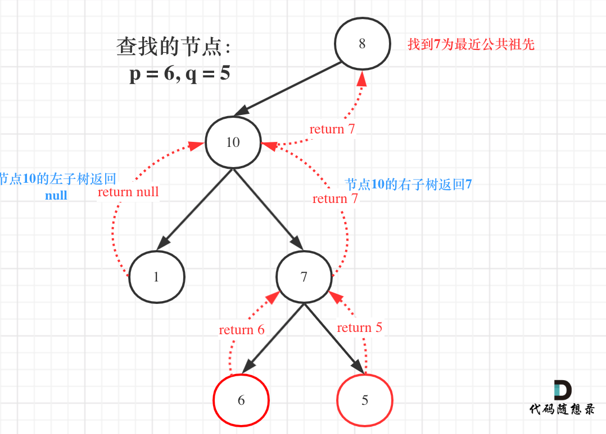

# 二叉树的最近公共祖先

# 1. 题目

题目链接：[https://leetcode.cn/problems/lowest-common-ancestor-of-a-binary-tree](https://leetcode.cn/problems/lowest-common-ancestor-of-a-binary-tree "https://leetcode.cn/problems/lowest-common-ancestor-of-a-binary-tree")

给定一个二叉树, 找到该树中两个指定节点的最近公共祖先。

百度百科中最近公共祖先的定义为：“对于有根树 T 的两个结点 p、q，最近公共祖先表示为一个结点 x，满足 x 是 p、q 的祖先且 x 的深度尽可能大（一个节点也可以是它自己的祖先）。”

例如，给定如下二叉树:  root = \[3,5,1,6,2,0,8,null,null,7,4]


示例 1: 输入: root = \[3,5,1,6,2,0,8,null,null,7,4], p = 5, q = 1 输出: 3 解释: 节点 5 和节点 1 的最近公共祖先是节点 3。

示例 2: 输入: root = \[3,5,1,6,2,0,8,null,null,7,4], p = 5, q = 4 输出: 5 解释: 节点 5 和节点 4 的最近公共祖先是节点 5。因为根据定义最近公共祖先节点可以为节点本身。

说明:

- 所有节点的值都是唯一的。
- p、q 为不同节点且均存在于给定的二叉树中。

# 2. 算法

这题我们首先想到需要自底向上遍历这个树，同时需要递归，因为公共节点需要一层层向上传递，传递过程如下：



自底向上遍历二叉树的方法只有后序遍历，同时要注意递归时的逻辑：

首先先得到左子树和右子树返回的结果，如果left == nullptr && right ≠ nullptr证明p和q全在右子树上，反之亦然；如果left ≠ nullptr && right ≠ nullptr 说明左右子树各有p和q，需要返回当前节点root。

```c++
/**
 * Definition for a binary tree node.
 * struct TreeNode {
 *     int val;
 *     TreeNode *left;
 *     TreeNode *right;
 *     TreeNode(int x) : val(x), left(NULL), right(NULL) {}
 * };
 */
class Solution {
public:
    TreeNode* lowestCommonAncestor(TreeNode* root, TreeNode* p, TreeNode* q) {
        if(root == p || root == q || root == nullptr)
            return root;
        
        TreeNode* left = lowestCommonAncestor(root -> left, p, q);
        TreeNode* right = lowestCommonAncestor(root -> right, p, q);
        if(left == nullptr && right == nullptr)
            return nullptr;
        else if(left == nullptr)
            return right;
        else if(right == nullptr)
            return left;
        else
            return root;
    }
}; /**
* Definition for a binary tree node.
* struct TreeNode {
*     int val;
*     TreeNode left;
*     TreeNode right;
*     TreeNode(int x) : val(x), left(NULL), right(NULL) {}
* };
/
class Solution {
public:
TreeNode lowestCommonAncestor(TreeNode root, TreeNode p, TreeNode* q) {
if(root == p || root == q || root == nullptr)
return root;

TreeNode* left = lowestCommonAncestor(root -> left, p, q);
TreeNode* right = lowestCommonAncestor(root -> right, p, q);
if(left == nullptr && right == nullptr)
return nullptr;
else if(left == nullptr)
return right;
else if(right == nullptr)
return left;
else
return root;
}
};
```
