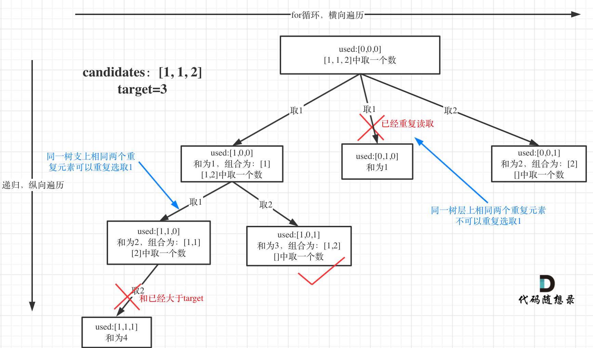

# 组合总和II

# 1. 题目

题目链接：[https://leetcode.cn/problems/combination-sum-ii](https://leetcode.cn/problems/combination-sum-ii "https://leetcode.cn/problems/combination-sum-ii")

给定一个数组 candidates 和一个目标数 target ，找出 candidates 中所有可以使数字和为 target 的组合。

candidates 中的每个数字在每个组合中只能使用一次。

说明： 所有数字（包括目标数）都是正整数。解集不能包含重复的组合。

- 示例 1:
- 输入: candidates = \[10,1,2,7,6,1,5], target = 8,
- 所求解集为:

```json
[
  [1, 7],
  [1, 2, 5],
  [2, 6],
  [1, 1, 6]
]
```

- 示例 2:
- 输入: candidates = \[2,5,2,1,2], target = 5,
- 所求解集为:

```json
[
  [1,2,2],
  [5]
]
```

# 2. 算法

本题需要注意重复问题，因为candidates中有重复元素，所以示例1可能会出现两个【1，2，5】的情况。具体如下：



所以我们要判断在树的同一层中，有没有取到和左兄弟相同的数字，如果取到了，就跳过。

我们使用used数组判断当前遍历的节点i是否和节点i - 1同一层，如果是同一层的就跳过，如果不是同一层的则可以选。具体的递归如下：

```c++
for (int i = startIndex; i < candidates.size() && target >= candidates[i];
     i++) {
  if (i > 0 && used[i - 1] == false && candidates[i] == candidates[i - 1])
    continue;
  path.push_back(candidates[i]);
  target -= candidates[i];
  used[i] = true;
  backTracing(candidates, target, i + 1, used);
  path.pop_back();
  target += candidates[i];
  used[i] = false;
}
```

- 如果used\[i] = true，说明i和i + 1不在同一层，因为used\[i]是在backTracing(candidates, target, i + 1, used);外面赋值为true。
- 如果used\[i] = false，说明i和i + 1在同一层，因为used\[i] = false且i通过for循环变成i+1了，这时候要判断candidates\[i] == candidates\[i - 1]；如果相等，说明左兄弟已经访问过这个数值了，需要跳过。

完整代码如下：

```c++
class Solution {
public:
    vector<int> path;
    vector<vector<int>> ans;
    vector<vector<int>> combinationSum2(vector<int>& candidates, int target) {
        vector<bool> used(candidates.size(), false);
        sort(candidates.begin(), candidates.end());
        if(candidates.empty())
            return ans;
        backTracing(candidates, target, 0, used);
        return ans;
    }

    void backTracing(vector<int>& candidates, int target, int startIndex, vector<bool>& used)
    {
        if(target == 0)
        {
            ans.push_back(path);
            return;
        }
        for(int i = startIndex; i < candidates.size() && target >= candidates[i]; i++)
        {
            if(i > 0 && used[i - 1] == false && candidates[i] == candidates[i - 1])
                continue;
            path.push_back(candidates[i]);
            target -= candidates[i];
            used[i] = true;
            backTracing(candidates, target, i + 1, used);
            path.pop_back();
            target += candidates[i];
            used[i] = false;
        }
    }
};
```
