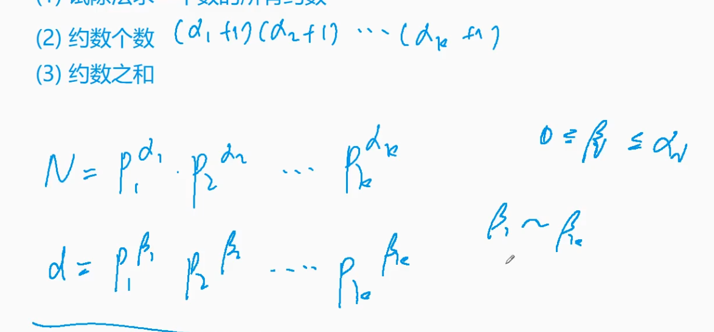
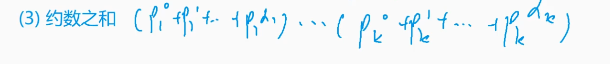

# 2 约数

# 1. 试除法求一个数所有约数（因数）

```c++
vector<int> get_divisor(int x)
{
  vector<int> ans;
  for (int i = 1; i <= x / i; i++)
  {
    if (x % i == 0)
    {
      ans.push_back(i);
      if (i != x / i)
        ans.push_back(x / i);
    }
  }
  return ans;
}
```

# 2. 约数个数

一个数的约数是由这个数的质约数相乘得到的，例如12的质约数为2\*2\*3，其中2可以取0\~2个，3可以取0\~1个，所以一共可以组成3\*2种质数。



```c++
int get_divisor_num(int x)
{
  int ans = 1;
  unordered_map<int, int> primes;
  for (int i = 2; i <= x / i; i++)
  {
    if (x % i == 0)
    {
      while (x % i == 0)
      {
        primes[i]++;
        x /= i;
      }
    }
  }
  if (x > 1)
    primes[x]++;

  for (auto prime : primes)
    ans = ans * (prime.second + 1);
  return ans;
}
```

# 3. 约数之和



```c++
#include <iostream>
#include <algorithm>
#include <unordered_map>
#include <vector>

using namespace std;

typedef long long LL;

const int N = 110, mod = 1e9 + 7;

int main()
{
    int n;
    cin >> n;

    unordered_map<int, int> primes;

    while (n -- )
    {
        int x;
        cin >> x;

        for (int i = 2; i <= x / i; i ++ )
            while (x % i == 0)
            {
                x /= i;
                primes[i] ++ ;
            }

        if (x > 1) primes[x] ++ ;
    }

    LL res = 1;
    for (auto p : primes)
    {
        LL a = p.first, b = p.second;
        LL t = 1;
        while (b -- ) t = (t * a + 1) % mod;
        res = res * t % mod;
    }

    cout << res << endl;

    return 0;
}

```

# 4. 欧几里得算法（辗转相除法）求最大公约数

```c++
 int gcd(int a, int b)
{
  if (b == 0)
    return a;
  else
    return gcd(b, a % b);
}
```
