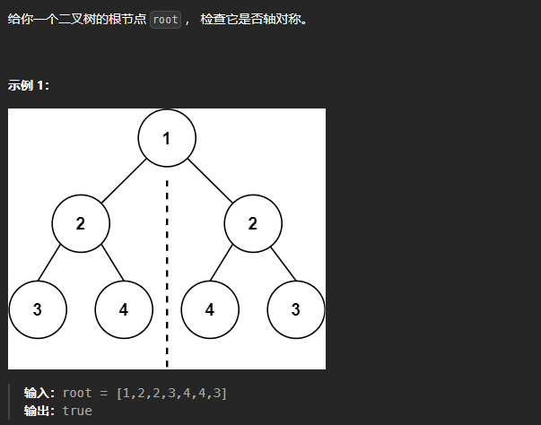

# 101. 对称二叉树

# 1. 题目



# 2. 题解

## 2.1 递归

```c++
/**
 * Definition for a binary tree node.
 * struct TreeNode {
 *     int val;
 *     TreeNode *left;
 *     TreeNode *right;
 *     TreeNode() : val(0), left(nullptr), right(nullptr) {}
 *     TreeNode(int x) : val(x), left(nullptr), right(nullptr) {}
 *     TreeNode(int x, TreeNode *left, TreeNode *right) : val(x), left(left), right(right) {}
 * };
 */
class Solution {
public:
    bool isSymmetric(TreeNode* root) {
        if(root == nullptr)
            return true;
        return judge(root -> left, root -> right);
    }

    bool judge(TreeNode* node1, TreeNode* node2)
    {
        if(node1 == nullptr && node2 == nullptr)
            return true;
        if(node1 != nullptr && node2 == nullptr)
            return false;
        if(node1 == nullptr && node2 != nullptr)
            return false;
        if(node1 -> val == node2 -> val)
        {
            if(judge(node1 -> left, node2 -> right) && judge(node1 -> right, node2 -> left))
                return true;
            else
                return false;
        }
        else
            return false;
    }
};
```

## 2.2 迭代

```c++
/**
 * Definition for a binary tree node.
 * struct TreeNode {
 *     int val;
 *     TreeNode *left;
 *     TreeNode *right;
 *     TreeNode() : val(0), left(nullptr), right(nullptr) {}
 *     TreeNode(int x) : val(x), left(nullptr), right(nullptr) {}
 *     TreeNode(int x, TreeNode *left, TreeNode *right) : val(x), left(left), right(right) {}
 * };
 */
class Solution {
public:
    bool isSymmetric(TreeNode* root) {
        if(root == nullptr)
            return true;
        return judge(root, root);
    }

    bool judge(TreeNode* u, TreeNode* v)
    {
        queue<TreeNode*> q;
        q.push(u);
        q.push(v);
        while(q.size())
        {
            u = q.front();
            q.pop();
            v = q.front();
            q.pop();
            if(u != nullptr && v != nullptr && u -> val == v -> val);
            else if(u == nullptr && v == nullptr)
                continue;
            else 
                return false;
            q.push(u -> left);
            q.push(v -> right);
            q.push(u -> right);
            q.push(v -> left);
        }
        return true;
    }
};
```
