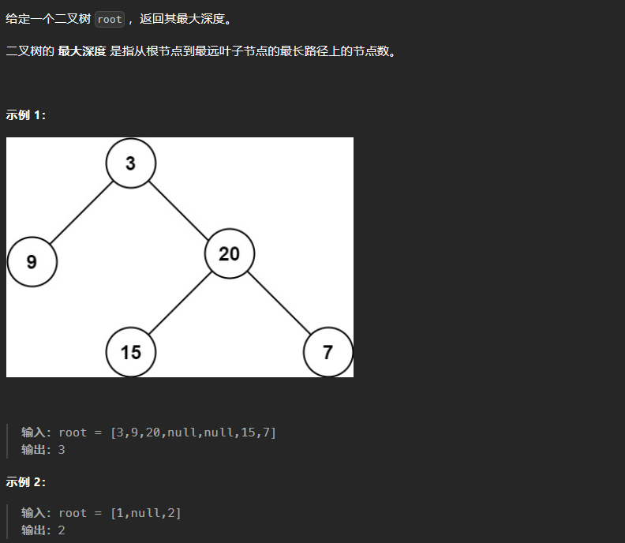

# 104. 二叉树的最大深度

# 1. 题目



# 2. 题解

## 2.1 深度优先搜索

```c++
/**
 * Definition for a binary tree node.
 * struct TreeNode {
 *     int val;
 *     TreeNode *left;
 *     TreeNode *right;
 *     TreeNode() : val(0), left(nullptr), right(nullptr) {}
 *     TreeNode(int x) : val(x), left(nullptr), right(nullptr) {}
 *     TreeNode(int x, TreeNode *left, TreeNode *right) : val(x), left(left), right(right) {}
 * };
 */
class Solution {
public:
    int maxDepth(TreeNode* root) {
        if(root == nullptr)
            return 0;
        int ans = 1;
        int left_ans = 0;
        int right_ans = 0;
        left_ans = maxDepth(root -> left);
        right_ans = maxDepth(root -> right);
        ans += max(left_ans, right_ans);
        return ans;
    }
};
```
