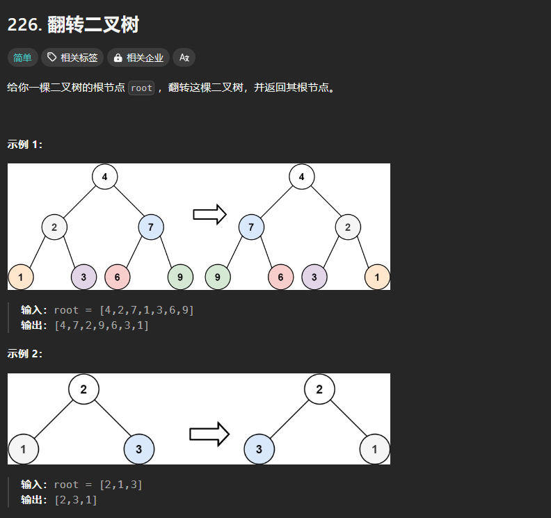

# 226. 翻转二叉树

# 1. 题目



# 2. 题解

递归

```c++
/**
 * Definition for a binary tree node.
 * struct TreeNode {
 *     int val;
 *     TreeNode *left;
 *     TreeNode *right;
 *     TreeNode() : val(0), left(nullptr), right(nullptr) {}
 *     TreeNode(int x) : val(x), left(nullptr), right(nullptr) {}
 *     TreeNode(int x, TreeNode *left, TreeNode *right) : val(x), left(left), right(right) {}
 * };
 */
class Solution {
public:
    TreeNode* invertTree(TreeNode* root) {
        if(root == nullptr)
            return nullptr;
        TreeNode* left = invertTree(root -> left);
        TreeNode* right = invertTree(root -> right);
        root -> left = right;
        root -> right = left;
        return root;
    }
};
```
