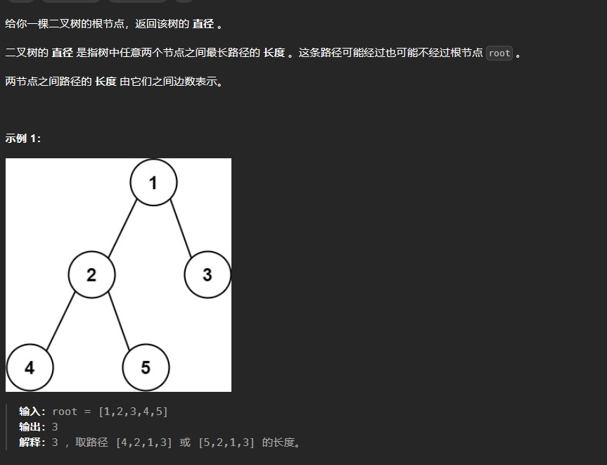
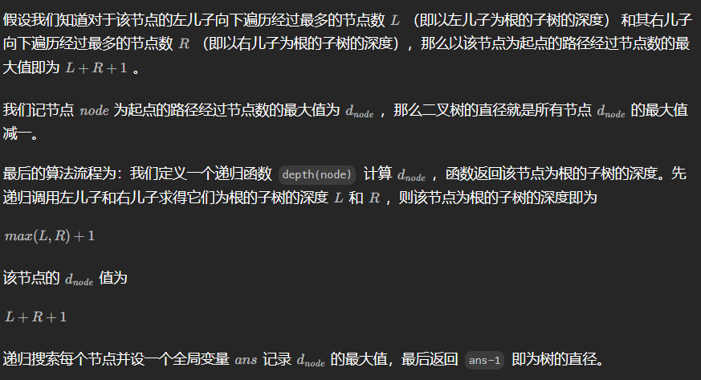

# 543. 二叉树的直径

# 1. 题目



# 2. 题解

任意一条路径均可以被看作由某个节点为起点，从其左儿子和右儿子向下遍历的路径拼接得到。



```c++
/**
 * Definition for a binary tree node.
 * struct TreeNode {
 *     int val;
 *     TreeNode *left;
 *     TreeNode *right;
 *     TreeNode() : val(0), left(nullptr), right(nullptr) {}
 *     TreeNode(int x) : val(x), left(nullptr), right(nullptr) {}
 *     TreeNode(int x, TreeNode *left, TreeNode *right) : val(x), left(left), right(right) {}
 * };
 */
class Solution {
public:
    int ans;
    int depth(TreeNode* node)
    {
        if(node == nullptr)
            return 0;
        int deep = 1;
        int left = depth(node -> left);
        int right = depth(node -> right);
        deep += max(left, right);
        ans = max(ans, left + right + 1);
        return deep;
    }

    int diameterOfBinaryTree(TreeNode* root) {
        depth(root);
        return ans - 1;
    }
};
```
