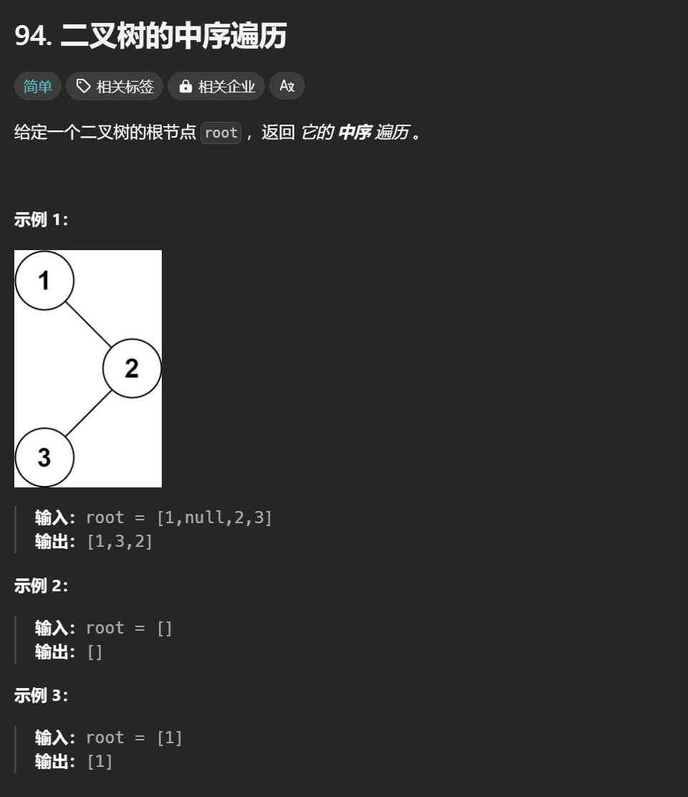

# 94. 二叉树的中序遍历

# 1. 题目



# 2. 题解

## 2.1 递归

```c++
/**
 * Definition for a binary tree node.
 * struct TreeNode {
 *     int val;
 *     TreeNode *left;
 *     TreeNode *right;
 *     TreeNode() : val(0), left(nullptr), right(nullptr) {}
 *     TreeNode(int x) : val(x), left(nullptr), right(nullptr) {}
 *     TreeNode(int x, TreeNode *left, TreeNode *right) : val(x), left(left), right(right) {}
 * };
 */

// 递归
class Solution
{
public:
    vector<int> inorderTraversal(TreeNode *root)
    {
        vector<int> ans;
        inorder(root, ans);
        return ans;
    }

    void inorder(TreeNode *root, vector<int> &ans)
    {
        if (root == nullptr)
            return;
        inorder(root->left, ans);
        ans.push_back(root->val);
        inorder(root->right, ans);
    }
};
```

## 2.2 迭代

使用stack模拟递归过程

```c++
/**
 * Definition for a binary tree node.
 * struct TreeNode {
 *     int val;
 *     TreeNode *left;
 *     TreeNode *right;
 *     TreeNode() : val(0), left(nullptr), right(nullptr) {}
 *     TreeNode(int x) : val(x), left(nullptr), right(nullptr) {}
 *     TreeNode(int x, TreeNode *left, TreeNode *right) : val(x), left(left), right(right) {}
 * };
 */
class Solution {
public:
    vector<int> inorderTraversal(TreeNode* root) {
        vector<int> ans;
        stack<TreeNode*> stk;
        while(root != nullptr || !stk.empty())
        {
            while(root != nullptr)
            {
                stk.push(root);
                root  = root -> left;
            }
            root = stk.top();
            ans.push_back(root -> val);
            stk.pop();
            root = root -> right;
        }
        return ans;
    }
};
```
