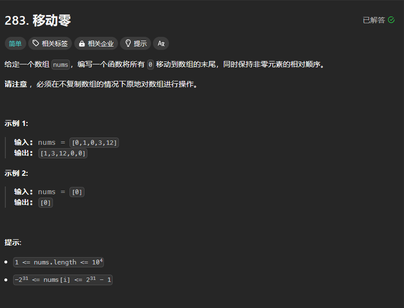

# 双指针

# 1. 题目



# 2. 题解

维护两个指针，左指针指向非零元素，右指针指向0.

```c++
class Solution {
public:
    void moveZeroes(vector<int>& nums) {
        int n = nums.size(), left = 0, right = 0;
        while (right < n) {
            if (nums[right]) {
                swap(nums[left], nums[right]);
                left++;
            }
            right++;
        }
    }
};

```
