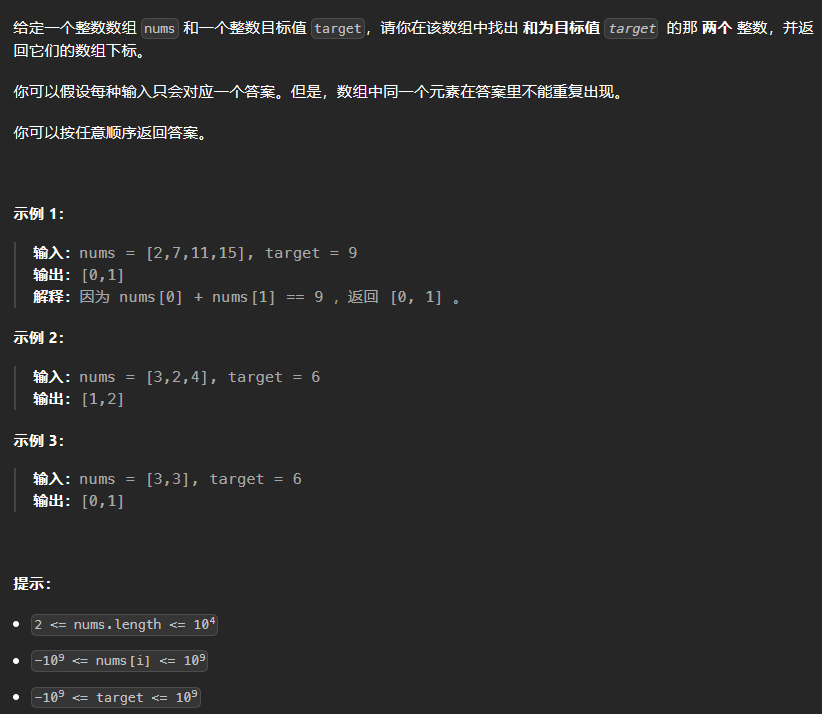

# 两数之和

# 1. 题目



# 2. 题解

1. 暴力：遍历每一个nums\[i]，然后计算target - nums\[i]，在寻找数组中有没有这个数。
2. 哈希：遍历每一个nums\[i]，然后计算x = target - nums\[i]，寻找哈希表中有没有这个x，要是没有就把nums\[i] 放入哈希中，索引为nums\[i]，值为i。

```c++
class Solution {
public:
    vector<int> twoSum(vector<int>& nums, int target) {
        unordered_map<int, int> hash;
        for (int i = 0; i < nums.size(); i++) {
            auto it = hash.find(target - nums[i]);
            if (it != hash.end())
                return {i, it->second};
            hash[nums[i]] = i;
        }
        return {};
    }
};
```
