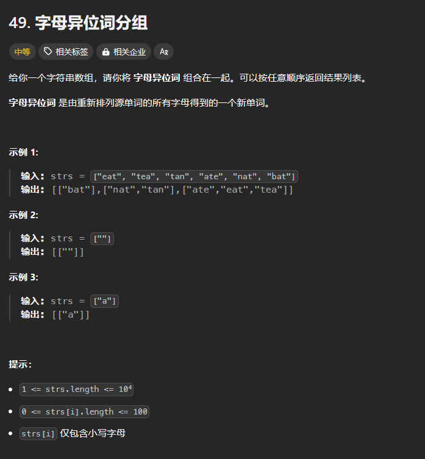

# 字母异位词分组

# 1. 题目



# 2. 题解

因为单词中字母相同，所以先将每个单词中字母从小到大排序，这样eat，tea就会变成aet。排序后将eat和tea放入索引为aet的哈希中。

```c++
class Solution {
public:
    vector<vector<string>> groupAnagrams(vector<string>& strs) {
        unordered_map<string, vector<string>> temp;
        for (int i = 0; i < strs.size(); i++) {
            string str = strs[i];
            sort(str.begin(), str.end());
            temp[str].emplace_back(strs[i]);
        }

        vector<vector<string>> ans;
        for (auto t : temp) {
            ans.push_back(t.second);
        }
        return ans;
    }
};

```
