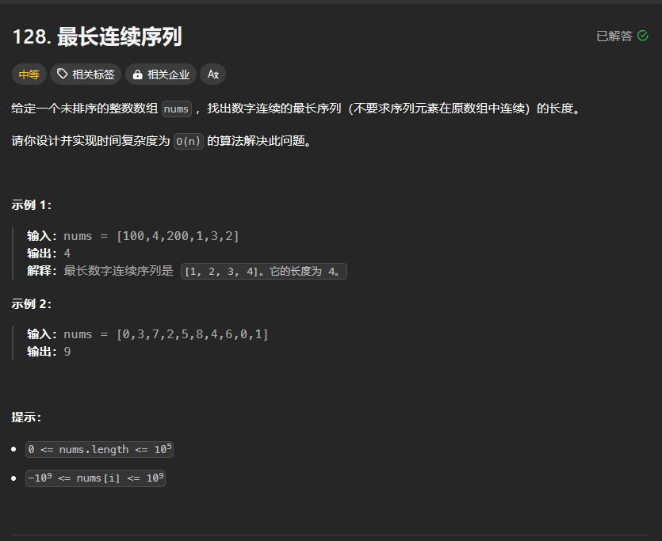

# 最长连续序列

# 1. 题目



# 2. 题解

先排序，再计算差分nums，如果nums\[i] == 1证明与上一个元素相差1，是连续的。如果与上面元素相差0，则与上一个元素相等，可以继续往下看。遍历过程使用双指针维护。

```c++
class Solution {
public:
    int longestConsecutive(vector<int>& nums) {
        int n = nums.size();
        if(n == 0)
            return 0;
        int ans = 0;
        sort(nums.begin(), nums.end());
        for(int i = n - 1; i >= 1; i--)
        {
            nums[i] -= nums[i - 1];
        }
        
        for(int i = 1; i < n; i++)
        {
            int j = i;
            int cnt = 0;
            while(j < n && (nums[j] == 1 || nums[j] == 0))
            {
                if(nums[j] == 1)
                    cnt++;
                j++;
            }
            ans = max(cnt, ans);
            i = j;
        }
        ans++;
        return ans;
    }
};      
```
