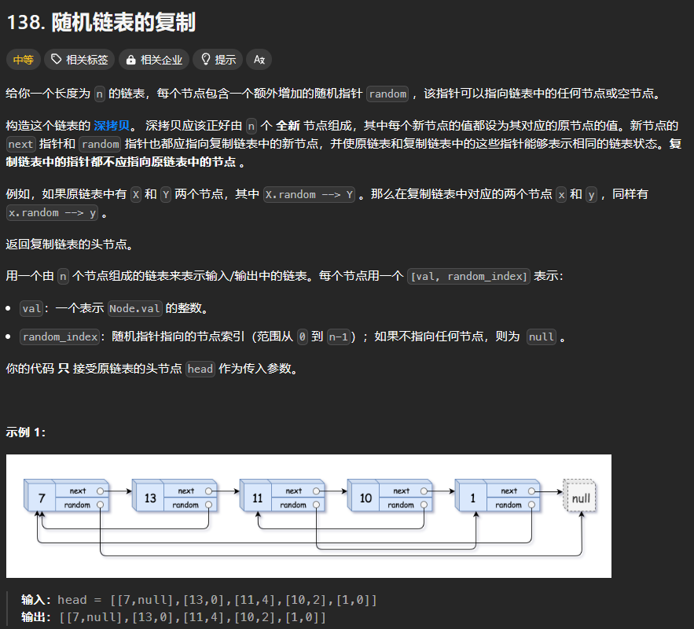

# 138. 随机链表的复制

# 1. 题目



# 2. 方法一：回溯+哈希表

本题的问题就在于无法确定一个节点的next和random节点是否已经被拷贝，所以我们使用一个hash表记录原节点和拷贝节点。

同时我们可以通过回溯法（或者叫递归），从头节点开始，递归到尾部，然后拷贝尾部节点并向上返回拷贝的节点。

```c++
/*
// Definition for a Node.
class Node {
public:
    int val;
    Node* next;
    Node* random;

    Node(int _val) {
        val = _val;3

        next = NULL;
        random = NULL;
    }
};
*/

// 方法1：回溯+哈希表
class Solution
{
public:
    unordered_map<Node *, Node *> hash;
    Node *copyRandomList(Node *head)
    {
        if (head == nullptr)
            return nullptr;
        if (hash.count(head) == 0)
        {
            Node *newnode = new Node(head->val);
            hash[head] = newnode;
            newnode->next = copyRandomList(head->next);
            newnode->random = copyRandomList(head->random);
        }
        return hash[head];
    }
};
```

# 3. 方法二：迭代+节点拆分

我们首先将该链表中每一个节点拆分为两个相连的节点，例如对于链表A→B→C，我们可以将其拆分为A→A\`→B→B\`→C→C\`，这样就在拷贝了所有节点，同时也保留了顺序信息，例如，拷贝节点A\`的后继节点为B\` = A\`→next→next

我们需要进行3次遍历：

第一次遍历，我们根据next拷贝整个链表。

第二次遍历，我们需要找到拷贝的数组的random指向。

第三次遍历，我们需要将新拷贝的节点的next指针指向下一个拷贝节点（一开始是指向下一个原节点的）。

```c++
// 方法2：迭代+节点拆分
class Solution
{
public:
    Node *copyRandomList(Node *head)
    {
        if (head == nullptr)
            return nullptr;
        for (Node *node = head; node != nullptr; node = node->next->next)
        {
            Node *newnode = new Node(node->val);
            newnode->next = node->next;
            node->next = newnode;
        }
        for (Node *node = head; node != nullptr; node = node->next->next)
        {
            Node *newnode = node->next;
            newnode->random = (node->random != nullptr) ? node->random->next : nullptr;
        }
        Node *newhead = head->next;
        for (Node *node = head; node != nullptr; node = node->next)
        {
            Node *newnode = node->next;
            node->next = node->next->next;
            newnode->next = (newnode->next) ? newnode->next->next : nullptr;
        }

        return newhead;
    }
};

```
