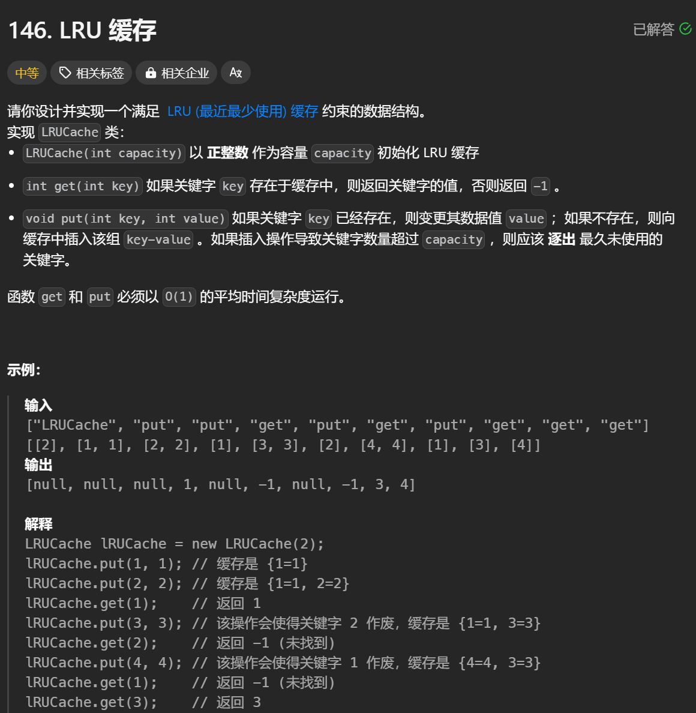

# 146. LRU缓存

# 1. 题目



# 2. 题解

构造一个双向链表，每个节点含有key, value信息。

同时在LRU类中设置head指针和tail指针，同时设置hash表，用于存储键为key的节点所在链表的位置。

```c++
struct DLinkNode
{
    DLinkNode* next;
    DLinkNode* prev;
    int key, value;
    DLinkNode(): key(-1), value(-1), next(nullptr), prev(nullptr) {}
    DLinkNode(int _key, int _value): key(_key), value(_value) {} 
};


class LRUCache {
public:
    DLinkNode* head;
    DLinkNode* tail;
    unordered_map<int, DLinkNode*> hash;
    int size;
    int capacity;

    LRUCache(int _capacity) {
        size = 0;
        capacity = _capacity;
        head = new DLinkNode();
        tail = new DLinkNode();
        head -> next = tail;
        tail -> prev = head;
    }
    
    int get(int key) {
        int answer = -1;
        if(hash.count(key))
        {
            DLinkNode* node = hash[key];
            answer = node -> value;
            move_to_front(node);
        }
        return answer;
    }
    
    void put(int key, int value) {
        if(hash.count(key))
        {
            DLinkNode* node = hash[key];
            node -> value = value;
            move_to_front(node);
        }
        else
        {
            if(size >= capacity)
            {
                add_to_front(key, value);
                remove_tail();
            }
            else
            {
                add_to_front(key, value);
            }
        }
    }

    void move_to_front(DLinkNode* node)
    {
        DLinkNode* front = node -> prev;
        DLinkNode* behind = node -> next;
        front -> next = behind;
        behind -> prev = front;
        DLinkNode* pre = head -> next;
        node -> next = head -> next;
        node -> prev = head;
        pre -> prev = node;
        head -> next = node;
    }

    void remove_tail()
    {
        DLinkNode* front = tail -> prev -> prev;
        DLinkNode* node = tail -> prev;
        front -> next = tail;
        tail -> prev = front;
        hash.erase(node -> key);
        size--;
    }

    void add_to_front(int key, int value)
    {
        DLinkNode* node = new DLinkNode(key, value);
        DLinkNode* pre = head -> next;
        node -> next = head -> next;
        node -> prev = head;
        pre -> prev = node;
        head -> next = node;
        hash[key] = node;
        size++;
    }
};

/**
 * Your LRUCache object will be instantiated and called as such:
 * LRUCache* obj = new LRUCache(capacity);
 * int param_1 = obj->get(key);
 * obj->put(key,value);
 */
```
