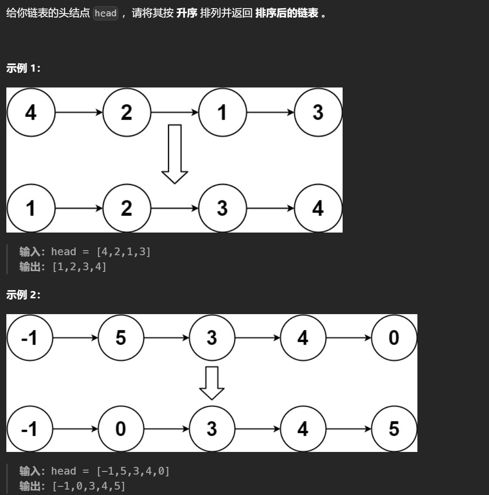

# 148. 排序链表

# 1. 题目



# 2. 题解

使用归并排序。

在寻找链表中点时，使用快慢指针，快指针走两步，慢指针走一步，这样当快指针到终点时，慢指针刚好在中点。

不过要注意的是，当快指针走一步就到终点时，则不用再走第二步，因为终点时nullptr，无法再走下一步。

同时，因为上述规则限制，导致merge(head, tail)中不会将tail排序（因为tail有可能等于nullptr），所以对于前半段的排序为merge(head, slow)，后半段的排序为merge(slow, tail)。

```c++
/**
 * Definition for singly-linked list.
 * struct ListNode {
 *     int val;
 *     ListNode *next;
 *     ListNode() : val(0), next(nullptr) {}
 *     ListNode(int x) : val(x), next(nullptr) {}
 *     ListNode(int x, ListNode *next) : val(x), next(next) {}
 * };
 */
class Solution {
public:
    //尾部的tail不进行排序
    ListNode* merge(ListNode* head, ListNode* tail)
    {
        if (head == nullptr) {
            return head;
        }
        //从这里可以看出尾部的tail不进行排序
        if (head->next == tail) {
            head->next = nullptr;
            return head;
        }
        ListNode* slow = head;
        ListNode* fast = head;
        while (fast != tail) {
            slow = slow -> next;
            fast = fast -> next;
            if (fast != tail) {
                fast = fast -> next;
            }
        }
        ListNode* node_1 = merge(head, slow);       //这里的slow不进行排序
        ListNode* node_2 = merge(slow, tail);
        ListNode* newhead = new ListNode();
        ListNode* newnode = newhead;
        while(node_1 != nullptr && node_2 != nullptr)
        {
            if(node_1 -> val <= node_2 -> val)
            {
                newnode -> next = node_1;
                newnode = newnode -> next;
                node_1 = node_1 -> next;
            }
            else
            {
                newnode -> next = node_2;
                newnode = newnode -> next;
                node_2 = node_2 -> next;
            }
        }
        if(node_1 != nullptr)
            newnode -> next = node_1;
        if(node_2 != nullptr)
            newnode -> next = node_2;
        return newhead -> next;
    }

    ListNode* sortList(ListNode* head) {
        return merge(head, nullptr);
    }
};
```
