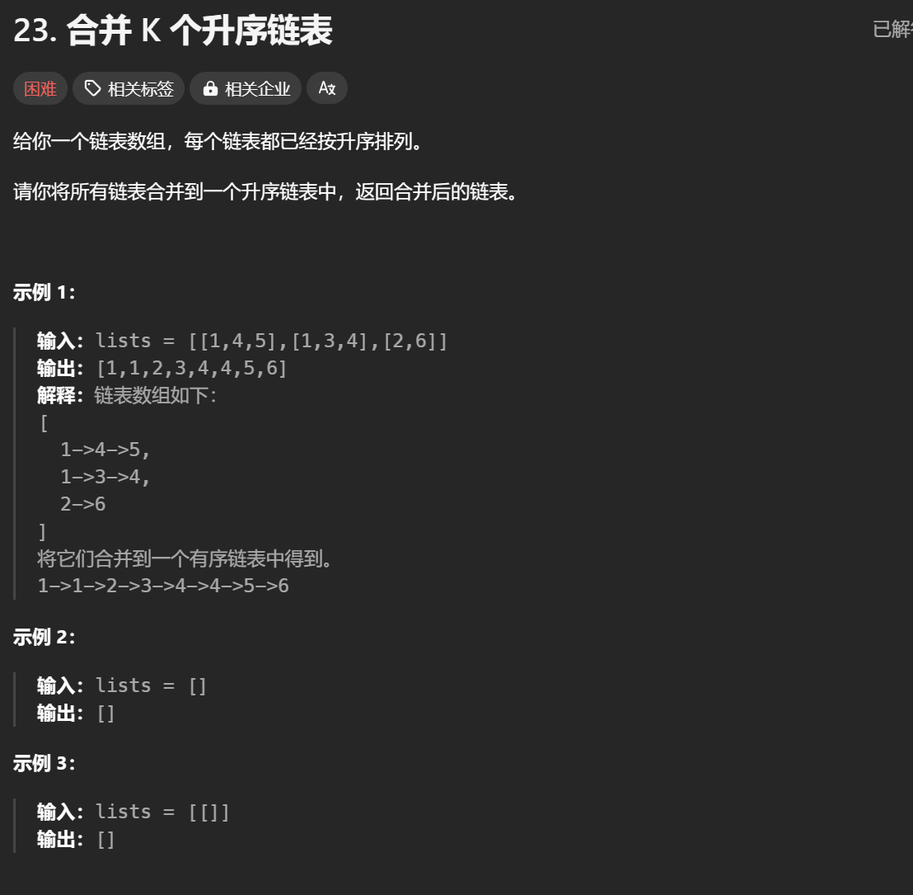
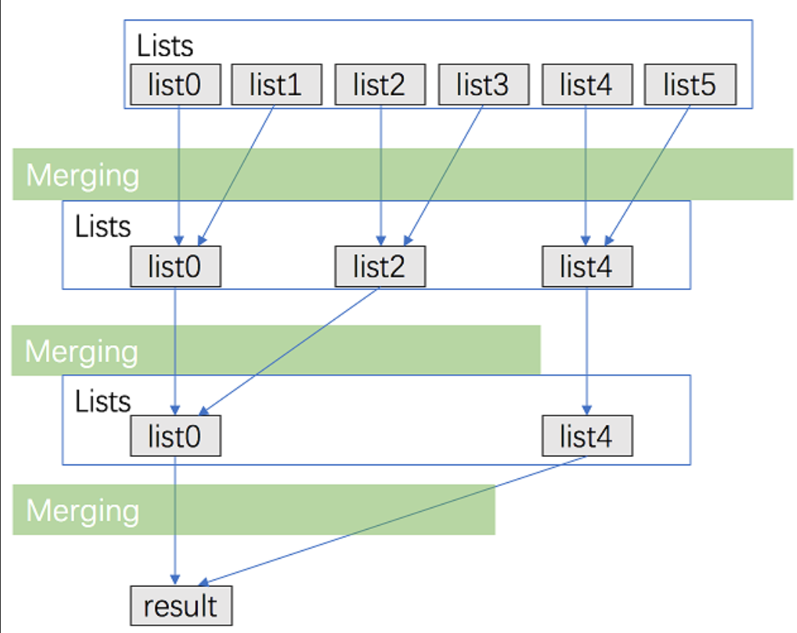

# 23. 合并 K 个升序链表

# 1. 题解



# 2. 题解

## 2.1 方法一：顺序合并

使用归并排序两两合并。

```c++
/**
 * Definition for singly-linked list.
 * struct ListNode {
 *     int val;
 *     ListNode *next;
 *     ListNode() : val(0), next(nullptr) {}
 *     ListNode(int x) : val(x), next(nullptr) {}
 *     ListNode(int x, ListNode *next) : val(x), next(next) {}
 * };
 */
class Solution {
public:
    ListNode* mergeTwoLists(ListNode* list1, ListNode* list2)
    {
        if(list1 == nullptr)
            return list2;
        if(list2 == nullptr)
            return list1;

        ListNode* node1 = list1;
        ListNode* node2 = list2;
        ListNode* newhead = new ListNode();
        ListNode* newnode = newhead;
        while(node1 != nullptr && node2 != nullptr)
        {
            if(node1 -> val <= node2 -> val)
            {
                newnode -> next = node1;
                node1 = node1 -> next;
            }
            else
            {
                newnode -> next = node2;
                node2 = node2 -> next;
            }
            newnode = newnode -> next;
        }
        if(node1)
            newnode -> next = node1;
        else
            newnode -> next = node2;

        return newhead -> next;
    }


    ListNode* mergeKLists(vector<ListNode*>& lists) {
        ListNode* newhead = nullptr;
        for(int i = 0; i < lists.size(); i++)
        {
            newhead = mergeTwoLists(lists[i], newhead);
        }

        return newhead;
    }
};
```

## 2.2 方法二：分治合并



```c++
/**
 * Definition for singly-linked list.
 * struct ListNode {
 *     int val;
 *     ListNode *next;
 *     ListNode() : val(0), next(nullptr) {}
 *     ListNode(int x) : val(x), next(nullptr) {}
 *     ListNode(int x, ListNode *next) : val(x), next(next) {}
 * };
 */
class Solution {
public:
    ListNode* mergeTwoLists(ListNode* list1, ListNode* list2)
    {
        if(list1 == nullptr)
            return list2;
        if(list2 == nullptr)
            return list1;

        ListNode* node1 = list1;
        ListNode* node2 = list2;
        ListNode* newhead = new ListNode();
        ListNode* newnode = newhead;
        while(node1 != nullptr && node2 != nullptr)
        {
            if(node1 -> val <= node2 -> val)
            {
                newnode -> next = node1;
                node1 = node1 -> next;
            }
            else
            {
                newnode -> next = node2;
                node2 = node2 -> next;
            }
            newnode = newnode -> next;
        }
        if(node1)
            newnode -> next = node1;
        else
            newnode -> next = node2;

        return newhead -> next;
    }

    ListNode* merge(vector<ListNode*>& lists, int l, int r)
    {
        if(l == r)
            return lists[l];
        if(l > r)
            return nullptr;
        int mid = l + r >> 1;
        return mergeTwoLists(merge(lists, l, mid), merge(lists, mid + 1, r));
    }


    ListNode* mergeKLists(vector<ListNode*>& lists) {
        return merge(lists, 0, lists.size() - 1);
    }
};
```

## 2.3 方法三：使用优先队列合并

```c++
class Solution {
public:
    struct Status {
        int val;
        ListNode *ptr;
        bool operator < (const Status &rhs) const {
            return val > rhs.val;
        }
    };

    priority_queue <Status> q;

    ListNode* mergeKLists(vector<ListNode*>& lists) {
        for (auto node: lists) {
            if (node) q.push({node->val, node});
        }
        ListNode head, *tail = &head;
        while (!q.empty()) {
            auto f = q.top(); q.pop();
            tail->next = f.ptr; 
            tail = tail->next;
            if (f.ptr->next) q.push({f.ptr->next->val, f.ptr->next});
        }
        return head.next;
    }
};

作者：力扣官方题解
链接：https://leetcode.cn/problems/merge-k-sorted-lists/submissions/563908941/
来源：力扣（LeetCode）
著作权归作者所有。商业转载请联系作者获得授权，非商业转载请注明出处。
```
