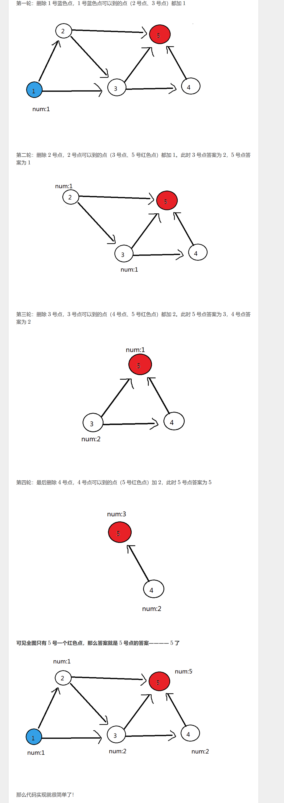

# P4017 最大食物链计数

# 最大食物链计数

## 题目背景

你知道食物链吗？Delia 生物考试的时候，数食物链条数的题目全都错了，因为她总是重复数了几条或漏掉了几条。于是她来就来求助你，然而你也不会啊！写一个程序来帮帮她吧。

## 题目描述

给你一个食物网，你要求出这个食物网中最大食物链的数量。

（这里的“最大食物链”，指的是**生物学意义上的食物链**，即**最左端是不会捕食其他生物的生产者，最右端是不会被其他生物捕食的消费者**。）

Delia 非常急，所以你只有 $1$ 秒的时间。

由于这个结果可能过大，你只需要输出总数模上 $80112002$ 的结果。

## 输入格式

第一行，两个正整数 $n、m$，表示生物种类 $n$ 和吃与被吃的关系数 $m$。

接下来 $m$ 行，每行两个正整数，表示被吃的生物A和吃A的生物B。

## 输出格式

一行一个整数，为最大食物链数量模上 $80112002$ 的结果。

## 样例 #1

### 样例输入 #1

```c++
5 7
1 2
1 3
2 3
3 5
2 5
4 5
3 4
```

### 样例输出 #1

```c++
5
```

## 提示

各测试点满足以下约定：


【补充说明】

数据中不会出现环，满足生物学的要求。（感谢 @AKEE ）

# 题解



```c++
#include<iostream>
#include<algorithm>
#include<vector>
#include<queue>
#include<cstring>
#include<map>
using namespace std;


#define max_num 500010
#define INFINITY 0x3f   
#define DIV 80112002
typedef pair<long long, long long> PII;


int n, m;
int head[max_num];
int e[max_num];
int ne[max_num];
int idx = 0;
bool visited[max_num];
int ans = 0;
int in_degree[max_num];
int out_degree[max_num];
int length[max_num];


void add(int x, int y)
{
  e[idx] = y;
  ne[idx] = head[x];
  head[x] = idx;
  idx++;
}


int main()
{
  int n, m;
  cin >> n >> m;
  queue<int> que;
  for (int i = 1; i <= n; i++)
    head[i] = -1;

  for (int i = 1; i <= m; i++)
  {
    int x, y;
    cin >> x >> y;
    add(x, y);
    in_degree[y]++;
    out_degree[x]++;
  }

  for (int i = 1; i <= n; i++)
  {
    if (in_degree[i] == 0)
    {
      que.push(i);
      length[i] = 1;
    }  
  }

  while (que.empty() == false)
  {
    int t = que.front();
    que.pop();
    for (int i = head[t]; i != -1; i = ne[i])
    {
      int j = e[i];
      in_degree[j]--;
      if (in_degree[j] == 0)
        que.push(j);
      length[j] += length[t];
      length[j] %= DIV;
    }
  }

  for (int i = 1; i <= n; i++)
  {
    if (out_degree[i] == 0)
    {
      ans += length[i];
      ans %= DIV;
    }
      
  }
  cout << ans << endl;
}
```
