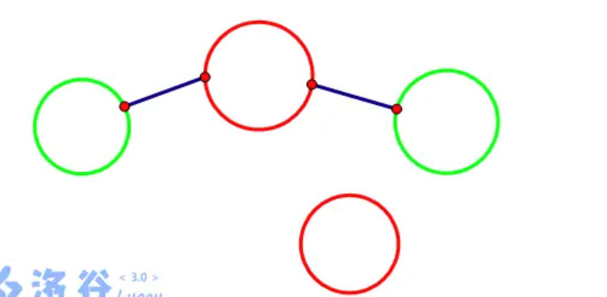
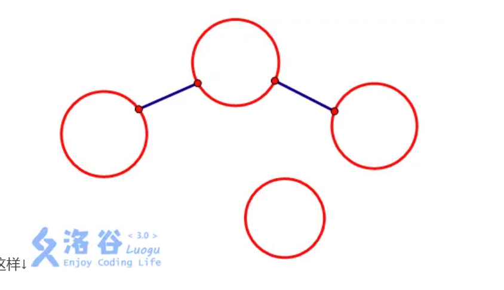

# P2700 逐个击破

# 逐个击破

## 题目描述

现在有 $N$ 个城市，其中 $K$ 个被敌方军团占领了，$N$ 个城市间有 $N-1$ 条公路相连，破坏其中某条公路的代价是已知的，现在，告诉你 $K$ 个敌方军团所在的城市，以及所有公路破坏的代价，请你算出花费最少的代价将这 $K$ 个地方军团互相隔离开，以便第二步逐个击破敌人。

## 输入格式

第一行包含两个正整数 $N$ 和 $K$。

第二行包含 $K$ 个整数，表示哪个城市被敌军占领。

接下来 $N-1$ 行，每行包含三个正整数 $a,b,c$，表示从 $a$ 城市到 $b$ 城市有一条公路，以及破坏的代价 $c$。城市的编号从 $0$ 开始。

## 输出格式

输出一行一个整数，表示最少花费的代价。

## 样例 #1

### 样例输入 #1

```c++
5 3
1 2 4
1 0 4
1 3 8
2 1 1
2 4 3
```

### 样例输出 #1

```c++
4
```

## 提示

对于 $10\%$ 的数据，$N\le 10$。

对于 $100\%$ 的数据，$2\le N\le10^5$，$2\le K\le N$，$1\le c\le 10^6$。

# 题解

这题想让你删掉边，但是没有什么算法可以删掉边。但是，所有边的总长度是固定的，那我们想要删掉边权和最小的边，就相当于在点之间插入边权和最大的边，然后在拿总长度减去插入的边，就是删掉边的长度之和了。

通过并查集可以表示节点之间连通情况，但要注意如果集合中根节点是敌人节点，那么加入这个集合中所有的节点都必须变成敌人节点，因为如果没有变成敌人节点，那么再将一个敌人节点连到此集合中的非敌人节点同样会导致敌方节点连通，所以要确保和敌人节点相连的节点都要变成敌人节点。如图所示：





```c++
#include<iostream>
#include<algorithm>
#include<vector>
#include<queue>
#include<cstring>
using namespace std;


#define max_num 100010
#define INFINITY 0x3f
typedef pair<int, int> PII;


int p[max_num];
bool state[max_num];

struct Edge
{
  int a;
  int b;
  long long w;
}edges[max_num];


bool cmp(Edge e1, Edge e2)
{
  return e1.w > e2.w;
}


int find(int x)
{
  if (p[x] != x)
    p[x] = find(p[x]);
  return p[x];
}


int main()
{
  long long total = 0;
  memset(state, false, sizeof state);
  int n, k;
  cin >> n >> k;
  for (int i = 0; i < n; i++)
    p[i] = i;
  for (int i = 1; i <= k; i++)
  {
    int num;
    cin >> num;
    state[num] = true;
  }
  for (int i = 1; i <= n - 1; i++)
  {
    cin >> edges[i].a >> edges[i].b >> edges[i].w;
    total += edges[i].w;
  }

  sort(edges + 1, edges + n + 1, cmp);

  long long res = 0;
  for (int i = 1; i <= n - 1; i++)
  {
    int a = edges[i].a, b = edges[i].b, w = edges[i].w;
    int fa = find(a), fb = find(b);
    if (state[fa] == true && state[fb] == true)
      continue;
    if (fa != fb)
    {
      p[fa] = fb;
       //如果两个根节点有一个是敌人节点，这两个要合并的集合的根节点也得变成敌人节点 
       if (state[fa] == true || state[fb] == true) 
        state[fb] = true;
    }
    res += w;
  }

  cout << total - res << endl;
}
```
